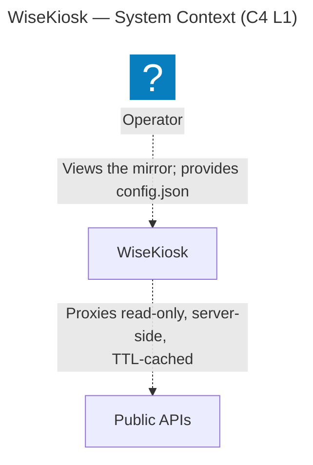
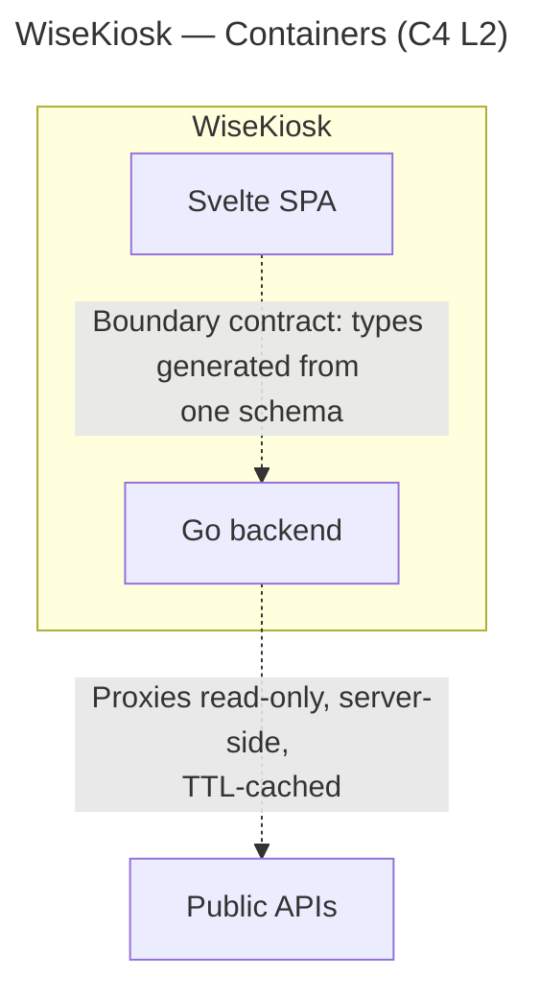

# Architecture

How the pieces of WiseKiosk actually fit together — the living structural description of the system
**as built**. It grows with the code.

> **Status: skeleton.** No code exists yet. Until a component is built, its *intended* shape is
> normative in the [requirements tree](requirements/README.md) and the
> [ADRs](decisions/README.md) — not here. This document records what is actually implemented, and
> structural rationale that is real but not weighty enough for an ADR. Each section below is filled
> in as its part of the system lands.

## System shape

One published container image serving a full-screen, config-driven smart-mirror display. A Go backend
proxies a handful of public APIs and serves the built frontend; a Svelte SPA renders modules into
regions of the page. See the [README](../README.md) for the product definition, and SYS005, SYS002,
SYS006 and SYS025 with their SRS children in the [requirements tree](requirements/README.md) for the
intended architecture until this section describes the built one.

The diagrams below are **generated from the validated [LikeC4 model](architecture/README.md)**, not
drawn by hand — edit `docs/architecture/model/` and run `just arch-export`, which regenerates the
Mermaid artifacts in [`docs/architecture/generated/`](architecture/generated/) and splices them
between the marker comments below (`scripts/splice-arch-diagrams.mjs`). Hand edits inside a marker
region are overwritten on the next export, and drift fails the staleness gate — see the
[architecture README](architecture/README.md) for the workflow.

**System context (C4 L1)** — the Operator, the WiseKiosk system, and the public APIs it proxies:

<!-- arch-export:begin generated/index.mmd -->

<!-- arch-export:end generated/index.mmd -->

**Containers (C4 L2)** — inside WiseKiosk: the Go backend and the Svelte SPA, the boundary contract
between them (one schema, both sides generated), and the backend's outbound API calls:

<!-- arch-export:begin generated/containers.mmd -->

<!-- arch-export:end generated/containers.mmd -->

## Backend

_To be documented as it is built._ Language and boundary-contract decision:
[ADR 0001](decisions/0001-backend-language-go.md). Normative shape: SRS001, SRS011, SRS015–SRS016,
SRS018, SRS020–SRS028, SRS065–SRS066, SRS074.

## Frontend

_To be documented as it is built._ Svelte 5 + Vite static SPA
([`FOUNDATIONS.md`](FOUNDATIONS.md) §2). Normative shape: SRS002, SRS005, SRS012–SRS014,
SRS031–SRS032, SRS038–SRS043, SRS056; configuration validation is frontend-owned per
[ADR 0007](decisions/0007-config-validation-allocation.md).

## The boundary contract

One schema definition, both sides generated from it — the load-bearing structural constraint of the
whole system (SYS007, SRS029–SRS032, [ADR 0001](decisions/0001-backend-language-go.md)). The codegen
mechanism is [ADR 0008](decisions/0008-boundary-contract-openapi-codegen.md): a single hand-authored
OpenAPI schema (3.0.3 now, 3.1 later), owned by neither package, with Go types generated by
`oapi-codegen` and TypeScript types by `openapi-typescript`, kept honest by a CI drift gate that
regenerates both sides and fails on any difference. The schema owns every value that crosses the
boundary — request parameters, success payloads, the structured upstream-failure and client-error
rejection bodies, and the status codes the frontend discriminates on.

_The concrete wiring — where the schema file lives, the generate step, the drift-check workflow — is
documented here once it is built (#7, after the repo layout in #5)._

## Config and secrets

_To be documented as it is built._ The backend is config-blind (SRS011); the configuration is a
static file bind-mounted into the served tree (SRS046) and delivered to the page byte-for-byte
(SRS009), validated by the frontend at apply time (SRS005) and by the standalone desk validator
(SRS008) through one implementation (SRS014), per
[ADR 0007](decisions/0007-config-validation-allocation.md). A secret reaches the backend only as the
file named by `<NAME>_FILE` — never through configuration, and never through a bare `<NAME>`
environment variable (SRS015, SRS017).

## Deployment

_To be documented as it is built._ Container image, bind-mounted config, `_FILE` secrets, fixed-port
healthcheck, `unless-stopped`. Normative shape: SRS044–SRS055, SRS057.

## Security & hardening

Container-hardening and CI-gating obligations are carried by the
[requirements tree](requirements/README.md): SYS005 (hardened, reproducible image), SYS010
(first-party code gated before merge), SYS010 (dependency risk gated and tracked), SYS005
(published-artifact supply-chain integrity) and SYS006 (runtime browser-security headers), each with
SRS children and TST verification items.

The posture **already enforced** (branch protection: all six checks required — `docs-and-hygiene`,
`secret-scan`, `process`, `requirements`, `architecture`, `docs-site` — strict, admins bound; secret
scanning with push protection, SHA-pinned Actions, least-privilege `GITHUB_TOKEN`, no custom
credentials in CI (SRS019), Dependabot for the Actions ecosystem) lives in `.github/` and the repo's
branch-protection settings. Requirements carry most of it — the required-check obligations
(SRS058, SRS060, SYS010), verify-CI parity (SRS067) and the credential-free rule (SRS019). Four are
carried by nothing and this paragraph is their only record: secret scanning with push protection,
SHA-pinned Actions, the least-privilege `GITHUB_TOKEN`, and Dependabot for the Actions ecosystem.
