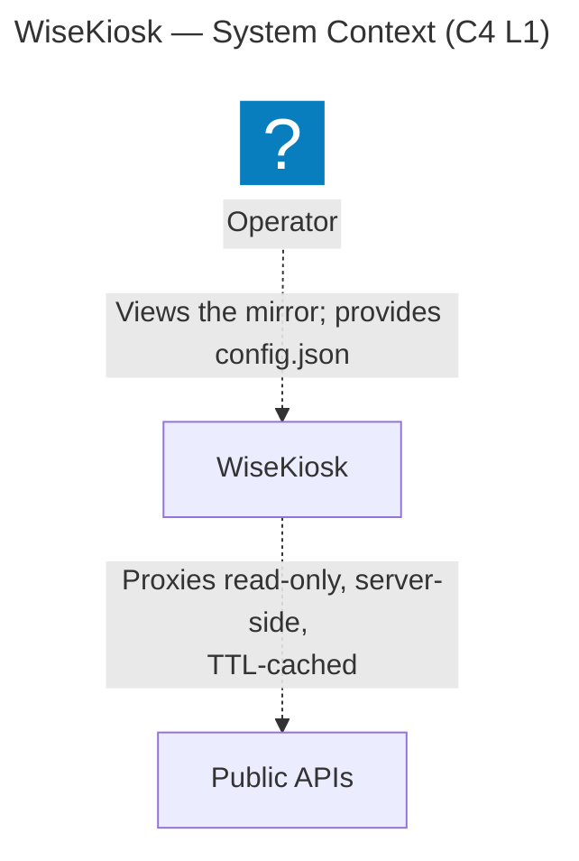
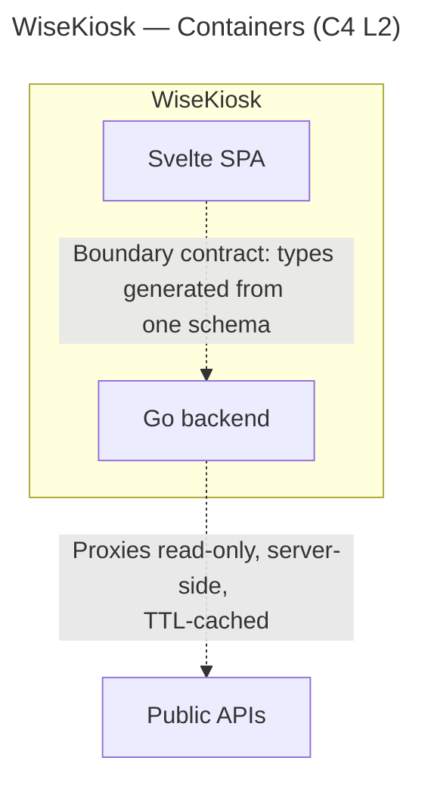

# Architecture

How the pieces of WiseKiosk actually fit together — the living structural description of the system
**as built**. It grows with the code.

> **Status: skeleton.** No code exists yet. Until a component is built, its *intended* shape is
> normative in the [requirements tree](requirements/README.md) and the
> [ADRs](decisions/README.md) — not here. This document records what is actually implemented, and
> structural rationale that is real but not weighty enough for an ADR. Each section below is filled
> in as its part of the system lands.

## System shape

One published container image serving a full-screen, config-driven smart-mirror display. A Go
backend proxies a handful of public APIs and serves the built frontend; a Svelte SPA renders modules
into regions of the page. See the [README](../README.md) for the product definition, and
SYS002<!-- The configured layout renders whole -->,
SYS004<!-- Upstream data reaches the display only through the backend --> and
SYS005<!-- Single-definition internal contract --> with their SRS children in the [requirements
tree](requirements/README.md) for the intended architecture until this section describes the built
one. The frontend's static-bundle shape is not a need: it is a repository check, in
[`CI.md`](CI.md).

The diagrams below are **generated from the validated [LikeC4 model](architecture/README.md)**, not
drawn by hand — edit `docs/architecture/model/` and run `just arch-export`, which regenerates the
Mermaid artifacts in [`docs/architecture/generated/`](architecture/generated/) and splices them
between the marker comments below (`scripts/splice-arch-diagrams.mjs`). Hand edits inside a marker
region are overwritten on the next export, and drift fails the staleness gate — see the
[architecture README](architecture/README.md) for the workflow.

**System context (C4 L1)** — the Operator, the WiseKiosk system, and the public APIs it proxies:

<!-- arch-export:begin generated/index.mmd -->

<!-- arch-export:end generated/index.mmd -->

**Containers (C4 L2)** — inside WiseKiosk: the Go backend and the Svelte SPA, the boundary contract
between them (one schema, both sides generated), and the backend's outbound API calls:

<!-- arch-export:begin generated/containers.mmd -->

<!-- arch-export:end generated/containers.mmd -->

## Backend

_To be documented as it is built._ Language and boundary-contract decision:
[ADR 0001](decisions/0001-backend-language-go.md); the backend's config-blindness is
[ADR 0007](decisions/0007-config-validation-allocation.md)'s. Normative shape:
SRS001<!-- A failed module shows why, and only that module -->,
SRS006<!-- Unresolvable secret surfaces as that source's upstream failure -->,
SRS008<!-- No secret value in any backend output -->,
SRS009<!-- Every source reachable through the backend, statelessly -->,
SRS011<!-- Upstream request rate is bounded, and the bound is not operator-tunable -->,
SRS012<!-- Request parameters validated against known-good per-source patterns -->,
SRS013<!-- Client-facing contract for rejected requests -->,
SRS016<!-- Both sides consume the generated types -->,
SRS019<!-- The backend runs on both supported architectures -->,
SRS028<!-- Served responses declare their type, and forbid the browser inferring one -->.

## Frontend

_To be documented as it is built._ Svelte 5 + Vite, a static single-page bundle served as static
files ([ADR 0001](decisions/0001-backend-language-go.md); the frontend stack's own decision record is
#60); each module's poll cadence is that module's own need, per
[the module contract](contracts/module-contract.md). Normative shape:
SRS002<!-- A module-scoped configuration error is reported at that module -->,
SRS003<!-- A configuration change applies no later than the next page load -->,
SRS005<!-- One validation implementation -->,
SRS010<!-- The display page reaches no origin but the backend's -->,
SRS016<!-- Both sides consume the generated types -->,
SRS017<!-- Full-screen assembly at kiosk; reflow, not overlap, at narrower widths -->,
SRS021<!-- Frontend runs on a Pi Zero-class browser host -->,
SRS024<!-- Every offered configuration key is exercised at a non-default value -->,
SRS026<!-- The display says when the backend is gone -->,
SRS027<!-- The display page holds no device capability it does not use -->; configuration
validation is frontend-owned per [ADR 0007](decisions/0007-config-validation-allocation.md).

## The boundary contract

One schema definition, both sides generated from it — the load-bearing structural constraint of the
whole system (SYS005<!-- Single-definition internal contract -->,
SRS015<!-- One schema, all boundary value classes -->–SRS016<!-- Both sides consume the generated types -->,
[ADR 0001](decisions/0001-backend-language-go.md)). The codegen mechanism is
[ADR 0008](decisions/0008-boundary-contract-openapi-codegen.md): a single hand-authored OpenAPI
schema (3.0.3 now, 3.1 later), owned by neither package, with Go types generated by `oapi-codegen`
and TypeScript types by `openapi-typescript`, kept honest by a CI drift gate that regenerates both
sides and fails on any difference. The schema owns every value that crosses the boundary — request
parameters, success payloads, the structured upstream-failure and client-error rejection bodies, and
the status codes the frontend discriminates on.

_The concrete wiring — where the schema file lives, the generate step, the drift-check workflow — is
documented here once it is built (#7, after the repo layout in #5)._

## Config and secrets

_To be documented as it is built._ The backend is config-blind, per
[ADR 0007](decisions/0007-config-validation-allocation.md), which also states byte-for-byte delivery
to the page; the configuration is a static file bind-mounted into the served tree
(SRS018<!-- One generic published image -->), validated by the frontend at apply time
(SRS002<!-- A module-scoped configuration error is reported at that module -->) and by the
standalone desk validator ([`../tools/README.md`](../tools/README.md)) through one implementation
(SRS005<!-- One validation implementation -->). A secret reaches the backend only as the file named
by `<NAME>_FILE` — never through configuration, and never through a bare `<NAME>` environment
variable (SRS007<!-- Configuration schema offers no secret-bearing key -->).

## Deployment

_To be documented as it is built._ Container image, bind-mounted config, `_FILE` secrets. Normative
shape: SRS018<!-- One generic published image -->,
SRS025<!-- No secret material in the published image -->,
SRS022<!-- A bounded running footprint -->, SRS020<!-- Non-root container user -->. The health
signal and the restart policy are properties of what ships rather than of the running system, and
are in [`../tools/README.md`](../tools/README.md).

## Security & hardening

Product-facing obligations are carried by the [requirements tree](requirements/README.md): the image
properties the product owes (SRS018<!-- One generic published image -->,
SRS025<!-- No secret material in the published image -->, SRS020<!-- Non-root container user -->)
under SYS003<!-- A deployment is parameterised from outside the image --> and
SYS006<!-- Neither grant privilege nor require it -->, and the served response's browser hardening
(SRS010<!-- The display page reaches no origin but the backend's -->,
SRS027<!-- The display page holds no device capability it does not use -->,
SRS028<!-- Served responses declare their type, and forbid the browser inferring one -->) under
SYS004<!-- Upstream data reaches the display only through the backend --> and
SYS006<!-- Neither grant privilege nor require it -->, each with TST verification items.
Published-artifact supply-chain integrity is not a requirement — it is material CI produces,
described in [`CI.md`](CI.md). Repository-facing gates — first-party and dependency scanning, image
scanning, and verify-CI parity — are [`CI.md`](CI.md)'s; no requirement states them.

The posture **already enforced** (branch protection: all six checks required — `docs-and-hygiene`,
`secret-scan`, `process`, `requirements`, `architecture`, `docs-site` — strict, admins bound; secret
scanning with push protection, SHA-pinned Actions, least-privilege `GITHUB_TOKEN`, Dependabot for the
Actions ecosystem) lives in `.github/` and the repo's branch-protection settings. What each of those
asserts is [`CI.md`](CI.md)'s: the action pins, the top-level token grants and the Actions ecosystem
entry are gated there, and secret scanning with push protection is recorded there as configuration no
workflow token can read.
