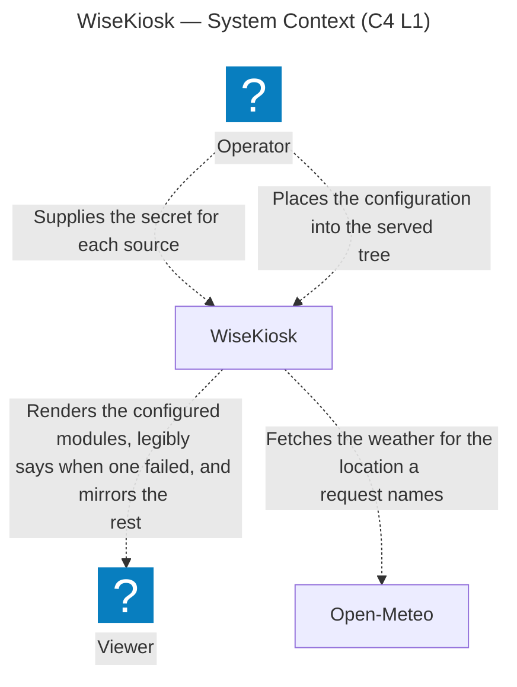
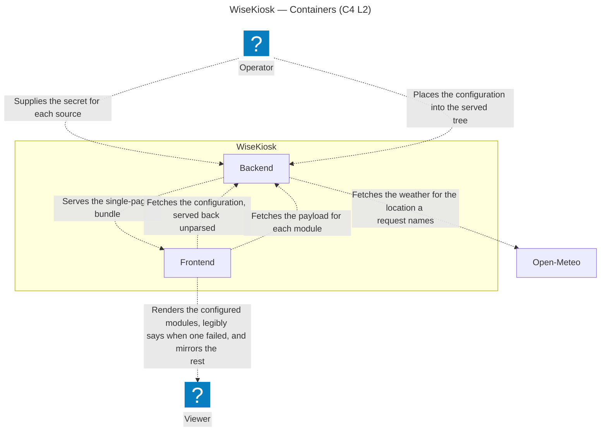
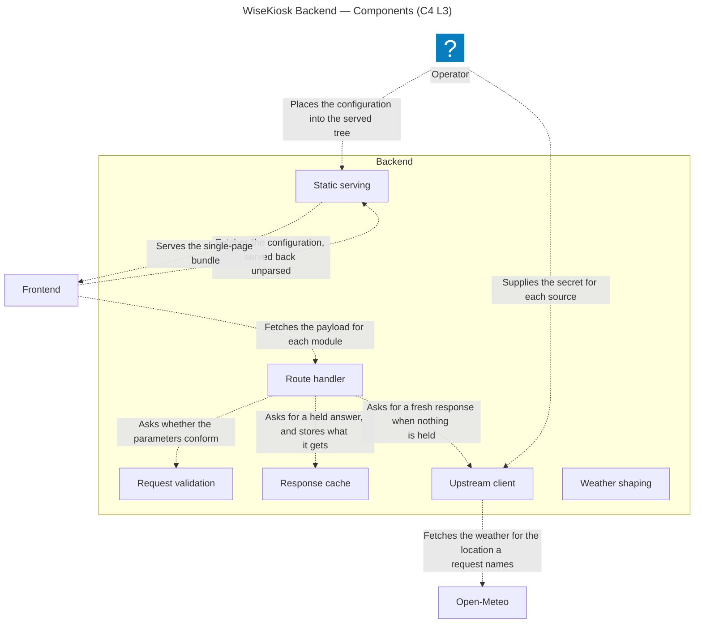
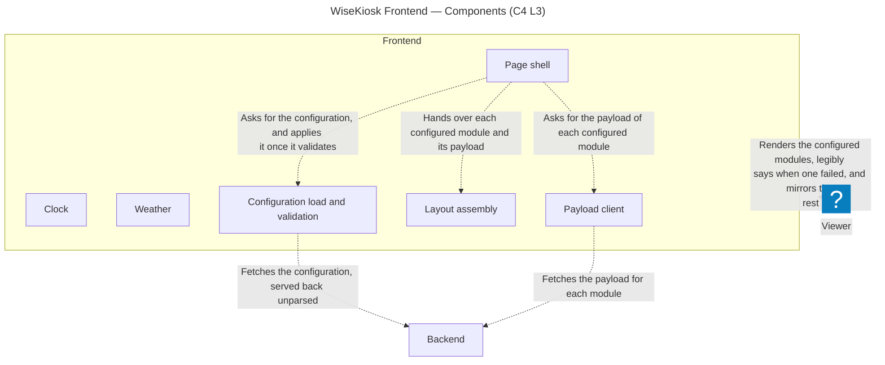
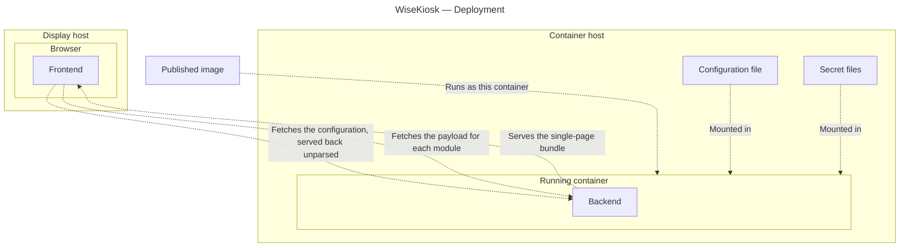

# Architecture

The living structural description of WiseKiosk **as built**. It grows with the code.

> **Status: built as each part lands.** A narrative section carries _To be documented as it is built._
> until the code it describes lands. The diagrams are the exception: they are generated from the
> [architecture model](architecture/README.md), which is normative for structure
> ([ADR 0003 rev 2](decisions/0003-architecture-as-code-likec4.md)). What `codegen mermaid` drops —
> element descriptions, icons — is read in that model, and an element's responsibility statement stays
> there rather than being copied beside it. What a component must *do* is the
> [requirements tree](requirements/README.md) and the [ADRs](decisions/README.md). This document holds
> structural rationale too light for an ADR, and cites the rest.

## System shape

One published container image serving a full-screen, config-driven smart-mirror display: a Go backend
proxying public APIs and serving the built frontend, and a Svelte SPA rendering modules into regions of
the page ([ADR 0019 rev 5](decisions/0019-boundary-at-what-deploys-and-tag-tier.md)). The product
definition is the [README](../README.md); the intended architecture until this section describes the
built one is SYS002<!-- The display's rendering keeps nothing from a viewer -->,
SYS004<!-- Upstream data reaches the display only through the backend --> and
SYS005<!-- Single-definition internal contract --> with their SRS children. The frontend's static-bundle
shape is a repository check, in [`CI.md`](CI.md), rather than a need.

Those two containers project onto two package roots — `backend/` and `frontend/` — with the one
boundary schema at `boundary/openapi.yaml` because it belongs to neither, and the release material in
`deploy/` because it is outside the boundary
([ADR 0021 rev 1](decisions/0021-repository-layout.md)).

Every diagram below is **generated from the validated [LikeC4 model](architecture/README.md)**, not
drawn by hand. Edit `docs/architecture/model/` and run `just arch-export`, which regenerates each
Mermaid artifact and splices it between its marker comments; a hand edit inside a marker region is
overwritten on the next export, and drift fails the staleness gate. The workflow is the
[architecture README](architecture/README.md)'s.

**System context (C4 L1)** — the Operator who deploys and configures WiseKiosk, the Viewer it renders
for, the boundary between them, which is what deploys — the published image and what it serves — and
the one upstream outside it. An upstream data source is drawn individually and only once the module
that reads it has a need in the tree
([ADR 0019 rev 5](decisions/0019-boundary-at-what-deploys-and-tag-tier.md)), so the level carries one
box per such module and no aggregate standing in for the rest. The requirements name no supplier:
which service a box is, is an edit to this repository rather than something the tree obliges.

<!-- arch-export:begin generated/index.mmd -->

<!-- arch-export:end generated/index.mmd -->
**Containers (C4 L2)** — what runs inside the boundary: the backend process, and the frontend bundle
executing in the browser on the display host. They share one origin, because the backend serves that
bundle and the configuration file as static content it never interprets
([ADR 0019 rev 5](decisions/0019-boundary-at-what-deploys-and-tag-tier.md),
[ADR 0007 rev 2](decisions/0007-config-validation-allocation.md)). What parameterises a deployment
(SYS003<!-- A deployment is parameterised from outside the image -->) reaches that filesystem as two
separate supplies: the secret for each source, resolved per request
(SRS006<!-- Unresolvable secret surfaces as that source's upstream failure -->), and the configuration,
which the image does not carry (SRS018<!-- One generic published image -->) and which reaches its
consumer on a second hop, when the page fetches it. The upstream drawn above appears here on the
backend, which is the container that reaches it — the frontend never does
(SYS004<!-- Upstream data reaches the display only through the backend -->).

<!-- arch-export:begin generated/containers.mmd -->

<!-- arch-export:end generated/containers.mmd -->
The Component level (C4 L3) is drawn per container, in the two sections below, and the Deployment level
in [§ Deployment](#deployment). The Backend container and each of its components carry a `link` to the
source implementing it; where that source sits is
[ADR 0021 rev 1](decisions/0021-repository-layout.md).

**Every accepted, active `SYS` or `SRS` item binds somewhere in this model, and where one cannot, the
model grows to draw what it obliges** — there is no exemption record, and which items are unbound is
`check-arch-trace`'s answer rather than this document's
([ADR 0019 rev 5](decisions/0019-boundary-at-what-deploys-and-tag-tier.md)). The **kind** of absence is
what a reader needs, and there is one: an item whose subject the model does not draw at all. The worked
example is the published image — neither container nor component, so the obligations on it sit at the
Deployment level, which is the level drawn to carry them.

## Backend

Its source root is `backend/`, the Go module root, holding the shared framework under `internal/` and
each upstream-backed module's shaping library under `internal/modules/<name>/`
([ADR 0021 rev 1](decisions/0021-repository-layout.md)). Language and
boundary-contract decision: [ADR 0001 rev 1](decisions/0001-backend-language-go.md); config-blindness:
[ADR 0007 rev 2](decisions/0007-config-validation-allocation.md). What the backend must do is the
[requirements tree](requirements/README.md); which obligations bind this container is the
[architecture model](architecture/README.md), as each is modelled (#119 C4 model completion). Neither is
restated here.

**One process, one port, three path spaces.** `cmd/` is the whole of the bootstrap: it builds the API
handler from the route registration list and the served tree from the directory it is pointed at, then
mounts the two beside liveness on one multiplexer — `/healthz`, `/api/`, and every other path served as
a file from that tree. Nothing is read at start-up but its own flags, so there is no configuration to
parse, no state held between requests and nothing to reload
([ADR 0007 rev 2](decisions/0007-config-validation-allocation.md)); the port and those flags are
[ADR 0020 rev 2](decisions/0020-release-artifact-set-and-operator-tooling.md)'s, and the wiring around
them is [`DEPLOYMENT.md`](DEPLOYMENT.md)'s. A
path the served tree does not hold answers 404 rather than the single-page bundle: the page is fetched
once and navigates nowhere ([ADR 0018 rev 1](decisions/0018-frontend-svelte-vite-static-spa.md)), so an
index fallback would serve a route nothing requests, at the cost of rendering a missing bundle as a
working one.

**Liveness answers for this process and for nothing behind it.** `/healthz` reports that the process is
serving, which is the one thing a single-host runtime can act on; it reaches no upstream, so a source
that is down is that module's failure on the display rather than an unhealthy container. The same
binary asks the question of a running instance from inside the image, which is what lets the image
declare a `HEALTHCHECK` without carrying an HTTP client beside it
([ADR 0020 rev 2](decisions/0020-release-artifact-set-and-operator-tooling.md)). It answers `GET` and
`HEAD` alone, because the schema declares a `get:` and the generated registration is method-scoped
([ADR 0008 rev 3](decisions/0008-boundary-contract-openapi-codegen.md)); another verb on that path
falls through to the served tree and gets its 404 rather than a 405, since the `/` seam matches the
path that the method-scoped pattern does not. A handler mounted on the bare multiplexer — which is
what a package's own test assembles — answers 405 there instead, so the two disagree by exactly the
catch-all that only the assembled server has. The display page is the second asker: it puts the same
question through the generated client, and reports an unanswered one once for the whole page,
standing its modules down rather than letting each report the outage as its own
(SRS026<!-- The display says when the backend is gone -->).

**Adding a route is adding one element to a list.** The registration list is a package holding a
literal, read by the bootstrap and by nothing else, and the framework refuses an entry it cannot
serve — an incomplete or internally inconsistent one, or a second entry for a source another already
claims — where the routes are built rather than at the first request that would fail. An incomplete
registration therefore stops the process at start-up instead of leaving one that boots, looks healthy
and serves one broken route.

**Every request runs the same three bounds in the same order: cache, budget, call.** The pipeline
answers from the held response where there is one, spends one of that source's tokens where there is
not, and only then makes the outbound call under a deadline and a size ceiling
(SRS014<!-- No single upstream exchange can stall or exhaust the backend -->). A cache hit spends no
token and is never rejected, so the two bounds compose rather than compete
(SRS011<!-- Upstream request rate is bounded, and the bound is not operator-tunable -->), and each
source's bucket is its own, so one source's traffic never consumes another's budget. Concurrent callers
of one uncached `(source, query)` share a single outbound call and its result, which is what makes
several clients missing cache together at start-up cost one upstream request rather than one each; the
exchange belongs to the pipeline rather than to any caller, so a caller that goes away neither cancels
it nor denies its result to the rest. A rate-limited request is not held, being a fact about this
moment's budget rather than about the source.

**Every outcome leaves as one named cause.** The pipeline classifies what happened — unreachable, timed
out, a status outside 200–299, a body over the ceiling, no token — and the route handler maps that to
the boundary body the schema defines for it, under the status the frontend discriminates on
([ADR 0026 rev 2](decisions/0026-boundary-error-body-shape.md)). What the framework itself refused —
parameters it rejected, a source it does not serve, a method that source does not answer, no token —
leaves as a client rejection. Everything else leaves as that module's upstream failure carrying the
module's name, the source's secret being unresolvable included: a fault in serving this source rather
than in the request that asked for it. A request whose context ended before an answer leaves that way
too, under a 503 and a cause naming the shutdown; a client disconnecting is the only thing that ends
one until the server gains a shutdown call to do it.
An outcome no case names is logged and answered under an undistinguished cause rather than quietly
rendered as one of the others.

**A secret is confined by the type holding it, not by a step that removes it.** A resolved secret is a
value whose every formatting and serialising path yields a fixed redaction, with one guarded unwrap
whose single call site is the outbound request
([ADR 0023 rev 2](decisions/0023-secret-output-containment.md)) — so reaching a response body, a header
or a log takes writing that unwrap, not forgetting an entry in a denylist. It is resolved per request
from the file named by `<NAME>_FILE` and held nowhere, so a rotated file takes effect on the next
request ([ADR 0024 rev 1](decisions/0024-secret-file-delivery.md)); one that cannot be resolved is that
source's upstream failure, naming the secret and neither its value nor the path tried
(SRS006<!-- Unresolvable secret surfaces as that source's upstream failure -->,
SRS008<!-- No secret value in any backend output -->).

**Components (C4 L3)**, diagrammed below; each box's responsibility is the model's, not restated here.
A module's own half of this container is its shaping library, drawn when that module's need lands
([ADR 0019 rev 5](decisions/0019-boundary-at-what-deploys-and-tag-tier.md)); the route handler calls
it twice — to build the upstream request and to parse the answer — so the framework half drawn beside
it cannot serve a payload on its own. The framework/module seam is drawn rather than inferred: one
shaping box appears per upstream-backed module and every other box on this level is shared framework.
A route's policies — parameter validation, both cache TTLs, rate limit, outbound
timeout, maximum response size — are one entry in the static registration list and live nowhere else
in code ([the module contract](contracts/module-contract.md)); that entry is data these components
read rather than a component of its own.

<!-- arch-export:begin generated/backendComponents.mmd -->

<!-- arch-export:end generated/backendComponents.mmd -->

**Cache and rate-limit defaults.** Three of the policies named above start from a default, and the
defaults are the `upstream` package's exported constants — `DefaultSuccessTTL`, `DefaultNegativeTTL`
and `DefaultRequestsPerMinute`. **The value lives there and only there;** what is here is what each
one is for, so a figure and its reasoning are one thing described twice rather than two figures that
agree today. A route refines them against its source — the success-response TTL paired with that
module's poll cadence ([the module contract](contracts/module-contract.md)) — but they are code
constants, not configuration: the bound they hold is SRS011's<!-- Upstream request rate is bounded, and the bound is not operator-tunable -->, which forbids raising it from outside the image.

- **`DefaultSuccessTTL` — the fresh end of the display's tolerance for stale data.** A
  `(source, query)` reaches upstream at most once per TTL however many clients ask and however often;
  on a route serving few distinct queries, the TTL — not the route-global rate limit — is what
  principally holds the upstream request rate down.
- **`DefaultNegativeTTL` — deliberately shorter than the success TTL**, so a transient upstream
  failure clears soon after the source recovers, yet long enough that a burst of requests during an
  outage collapses to one retry per window against a source already failing.
- **`DefaultRequestsPerMinute` — a route-global ceiling on requests that reach upstream**; a cache hit
  is neither counted against it nor rejected. Steady state is roughly one upstream fetch per success
  TTL, so the ceiling sits well above legitimate traffic — headroom for several clients missing cache
  together at start-up — while still rejecting a client stuck in a fast retry loop. It reinforces the
  TTL bound rather than replacing it.

**The outbound timeout, the response size ceiling and the bucket's burst have no default, and that is
the decision rather than an omission.** No document in the tree names a value or a range for any of
the three, so there is nothing for a constant to hold; `upstream.Config` records the same from the
code side. Each registration entry therefore states its own, and a module author chooses rather than
inherits. Nothing in the framework supplies one or checks that an entry did — the deadline and the
ceiling SRS014<!-- No single upstream exchange can stall or exhaust the backend --> obliges rest on
the entry declaring them, which is a gap a first real module either closes or gives a value worth
defaulting.

**Three of those figures multiply, which is the arithmetic a module author is choosing against.** The
cache sweeps expired entries on every write, so what a route can hold is what it can write inside one
success TTL: at most `RequestsPerMinute × SuccessTTL` entries of up to `MaxBytes` each. That product
is the route's worst-case resident bytes, and it is where the two undefaulted figures land — a
generous `MaxBytes` is multiplied by however many distinct queries the rate admits, not paid once.
SRS022<!-- A bounded running footprint --> is met by the sweep whatever the values are; what the
values decide is whether the bound sits inside the host
SYS007<!-- The declared minimum host, and staying within it --> declares.

None of the three defaults can be proven against a source until one exists; each is a starting point a
module revisits when its upstream lands.

## Frontend

Its source root is `frontend/`, the npm package root, holding the
framework half under `src/lib/`, each module's component and configuration-schema fragment under
`src/modules/<name>/`, and the configuration schema those fragments compose into under `src/config/`
([ADR 0021 rev 1](decisions/0021-repository-layout.md)). Svelte 5 + Vite, a static single-page bundle
served as static files ([ADR 0018 rev 1](decisions/0018-frontend-svelte-vite-static-spa.md)); each
module's poll cadence is that module's own need
([the module contract](contracts/module-contract.md)); configuration validation is frontend-owned
([ADR 0007 rev 2](decisions/0007-config-validation-allocation.md)). What the display page must do is the
[requirements tree](requirements/README.md); which obligations bind this container is the
[architecture model](architecture/README.md), as each is modelled (#119 C4 model completion). Neither is
restated here.

**Components (C4 L3)**, diagrammed below; each box's responsibility is the model's, not restated here.
A module's own half of this container is its Svelte component, drawn when that module's need lands
([ADR 0019 rev 5](decisions/0019-boundary-at-what-deploys-and-tag-tier.md)). The framework/module seam
is drawn rather than inferred: one component box appears per module whatever its shape — a local
module has no other box anywhere in the model — and every other box on this level is shared
framework. The edge to the Viewer still leaves this container rather than any one of those boxes,
because what a viewer is shown is the assembled surface: the configured modules placed together, one
of them saying it failed, the rest of it mirrored — which no single component renders. Assembly's
discipline — placing what it is handed, fetching nothing — is the module contract's rule for a module
component, applied one level up. The bundle that becomes this container arrives on the one edge drawn
server-to-client, terminating on the container rather than on a child because no component exists to
fetch what has yet to run; `include *` does not reach it, so this view alone omits where the bundle
comes from, and the Backend's view above is where it is drawn.

<!-- arch-export:begin generated/frontendComponents.mmd -->

<!-- arch-export:end generated/frontendComponents.mmd -->

**One load, then nothing.** The page mounts, fetches the configuration once, and renders. There is no
router, no navigation and no second load path: a configuration change applies at the next page load
and by no other route, which is what
SRS003<!-- A configuration change applies no later than the next page load --> asks for and what lets
the shell hold no lifecycle beyond that one fetch. The fetch bypasses every HTTP cache, because the
conventional server-side fix is a header on a configuration path and the backend has no such path
([ADR 0007 rev 2](decisions/0007-config-validation-allocation.md)).

**Every outcome of that load renders something.** The four failure classes
SRS004<!-- Page renders a legible error state for every configuration failure class --> names — the
file absent, unfetchable, unparsable, or rejected by the schema — each render their own plain-language
state, and the load itself renders as a load. A rejected configuration lists every fault the schema
found rather than the first, which is why the validator collects them all
([ADR 0028 rev 1](decisions/0028-bundled-config-validator.md)).

**The configuration schema is enforced once, by code the schema generates.** The schema is authored as
JSON Schema 2020-12 ([ADR 0022 rev 1](decisions/0022-config-schema-format.md)) and compiled at build
time to a standalone validation function, so the bundle carries a function specialised to it rather
than a schema evaluator ([ADR 0028 rev 1](decisions/0028-bundled-config-validator.md)). The
configuration-object TypeScript types are generated from the same file and drift-gated, so the
schema is the one statement of the configuration's shape and the region roster
([ADR 0025 rev 2](decisions/0025-display-region-roster.md)) has one machine-readable form that both
the validator and the layout read.

**The frame is a grid the region names anchor into, not a set of cells content fills.** Three columns
and seven rows: the two bars span the width at top and bottom, the corner rows anchor their three
columns, and the centre column's three bands take equal shares of what the bars leave. Every region
is laid out beside the others rather than over them
([ADR 0025 rev 2](decisions/0025-display-region-roster.md)), and a region the configuration names no
module for is not laid out at all. The bands are bounded rather than content-sized, so content too
large for one leaves it rather than growing it
(SRS031<!-- Content too large for its region overflows -->).

**Layout assembly places what it is handed and fetches nothing.** A configuration entry's module name
resolves through a registry in `src/lib/`, which is empty until the first module lands (#12 first
module end-to-end); a name it cannot resolve renders as that region's own state rather than as an
empty region. The render tier substitutes its own registry for that one, which is the only thing it
replaces.

**Shared design tokens are delivered as `:root` custom properties** in `src/app.css`, whose values are
[the display styling contract](contracts/display-styling-contract.md)'s. The edge band is one of them:
the configuration's depth is a percentage of the display's height, joined to a CSS length in one
place, and absent means none is assumed
(SRS035<!-- The masked edge band is the deployment's to declare -->).

## The boundary contract

One schema definition, both sides generated from it — the load-bearing structural constraint of the
whole system (SYS005<!-- Single-definition internal contract -->,
SRS015<!-- One schema, all boundary value classes -->–SRS016<!-- Both sides consume the generated types -->,
[ADR 0001 rev 1](decisions/0001-backend-language-go.md)). The mechanism is
[ADR 0008 rev 3](decisions/0008-boundary-contract-openapi-codegen.md): one hand-authored OpenAPI schema
(3.0.3, with 3.1 the stated migration target), owned by neither package, the Go side generated by
`oapi-codegen` and the TypeScript side by `orval`, kept honest by a CI drift gate that
regenerates both sides and fails on any difference. The schema owns every value crossing the boundary —
request parameters, success payloads, the structured upstream-failure and client-error rejection bodies,
and the status codes the frontend discriminates on.

The one schema is `boundary/openapi.yaml`, and what is generated from it is committed inside the
package that compiles it ([ADR 0021 rev 1](decisions/0021-repository-layout.md)). What the drift
gate asserts, and what it leaves unproven, is [`CI.md`](CI.md) § *Generated boundary contract*.

The generate step reads that one file twice. `oapi-codegen`, pinned by the Go module's `tool`
directive, emits `backend/internal/boundary/`; `orval`, pinned to an exact version in the frontend
package, emits `frontend/src/lib/boundary/`. Each emits the whole wire contract for its side — types,
the route table, and a client — so neither package registers or calls a path it wrote itself, and a
path that moves in the schema alone is drift the gate sees. The image harnesses under `scripts/` name
`/healthz` in a constant of their own, deliberately: they probe a built container from outside both
packages, so what they assert against is a running server rather than a generated declaration, and a
rename fails them loudly in `check-image`. Neither generator knows about the other, and neither package's
build reaches across — what the two sides share is the schema and nothing else, which is the whole of
the arrangement. `just codegen` runs both; `just check-boundary` clears the two generated directories,
runs both again, compiles each side's output, and fails on any difference against what is committed,
so the committed contract cannot drift from the schema without a gate saying so.

Two kinds of path live in that schema. A **module data route** carries the full component set — its
success payload plus the two error bodies — and a module contributes its payload as a named component
of the same file; the error bodies are
[ADR 0026 rev 2](decisions/0026-boundary-error-body-shape.md)'s. An **infrastructure route** answers
about the process rather than about a source and declares its own response alone — `/healthz` is one,
and its 200 carries no body at all. Which paths of either kind exist is the schema's to say, and is
not counted here.

## Config and secrets

_To be documented as it is built._ The backend is config-blind and delivers the configuration
byte-for-byte to the page ([ADR 0007 rev 2](decisions/0007-config-validation-allocation.md)); the
configuration is a static file bind-mounted into the served tree
(SRS018<!-- One generic published image -->), validated in the page and nowhere else at apply time,
where a module-scoped error is reported at that module
(SRS002<!-- A module-scoped configuration error is reported at that module -->). A secret reaches the
backend only as the file named by `<NAME>_FILE`, never through a bare `<NAME>` environment variable
([ADR 0024 rev 1](decisions/0024-secret-file-delivery.md)) — and never through the configuration, which
offers no secret-bearing key (SRS007<!-- Configuration schema offers no secret-bearing key -->).

## Deployment

**Deployment** — what the project publishes, the hosts that run it, and the files the operator places
beside them ([ADR 0019 rev 5](decisions/0019-boundary-at-what-deploys-and-tag-tier.md)). It is not one
of C4's four core levels: C4's fourth is Code, and deployment is a supplementary diagram mapping
containers onto the infrastructure they run on.

<!-- arch-export:begin generated/deployment.mmd -->

<!-- arch-export:end generated/deployment.mmd -->
The published image is the one node here that exists before any deployment does, and it is drawn because
the obligations on it are obligations on the artifact rather than on the process it becomes. The
container host and the display host are **roles, not machines**, with different floors; in the
configuration this is built for they are necessarily separate machines. Why each of those is so, and why
a host carries a tag only where an item obliges the operator, is
[ADR 0019 rev 5](decisions/0019-boundary-at-what-deploys-and-tag-tier.md)'s.

**The image carries a CA trust store.** Every module's upstream is fetched by the backend rather than
by the browser (SYS004<!-- Upstream data reaches the display only through the backend -->), over
HTTPS, so the trust anchors those fetches verify against are part of the artifact. A base image
without them builds and starts perfectly well and fails certificate verification at the first upstream
request — a run-time failure on a configured deployment rather than a build-time one here.

The concrete wiring — the deployment recipe, the mount paths, the example configuration a release
carries — is [`DEPLOYMENT.md`](DEPLOYMENT.md)'s, and so are the health signal and the restart policy:
each is a property of what ships rather than of the running system.

## Security & hardening

Product-facing obligations are carried by the [requirements tree](requirements/README.md): the image
properties the product owes (SRS018<!-- One generic published image -->,
SRS025<!-- No secret material in the published image -->, SRS020<!-- Non-root container user -->) under
SYS003<!-- A deployment is parameterised from outside the image --> and
SYS006<!-- Neither grant privilege nor require it -->, and the served response's browser hardening
(SRS010<!-- The display page reaches no origin but the backend's -->,
SRS027<!-- The display page holds no device capability it does not use -->,
SRS028<!-- Served responses declare their type, and forbid the browser inferring one -->) under
SYS004<!-- Upstream data reaches the display only through the backend --> and
SYS006<!-- Neither grant privilege nor require it -->, each with TST verification items.

Everything else here is [`CI.md`](CI.md)'s and no requirement states it: published-artifact
supply-chain integrity, which is material CI produces; the repository-facing gates; the branch
protection that makes each gate job required, held there against the workflow rather than listed here;
and secret scanning with push protection, recorded there as configuration no workflow token can read.
