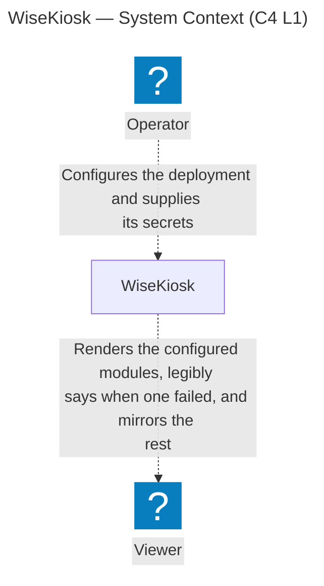
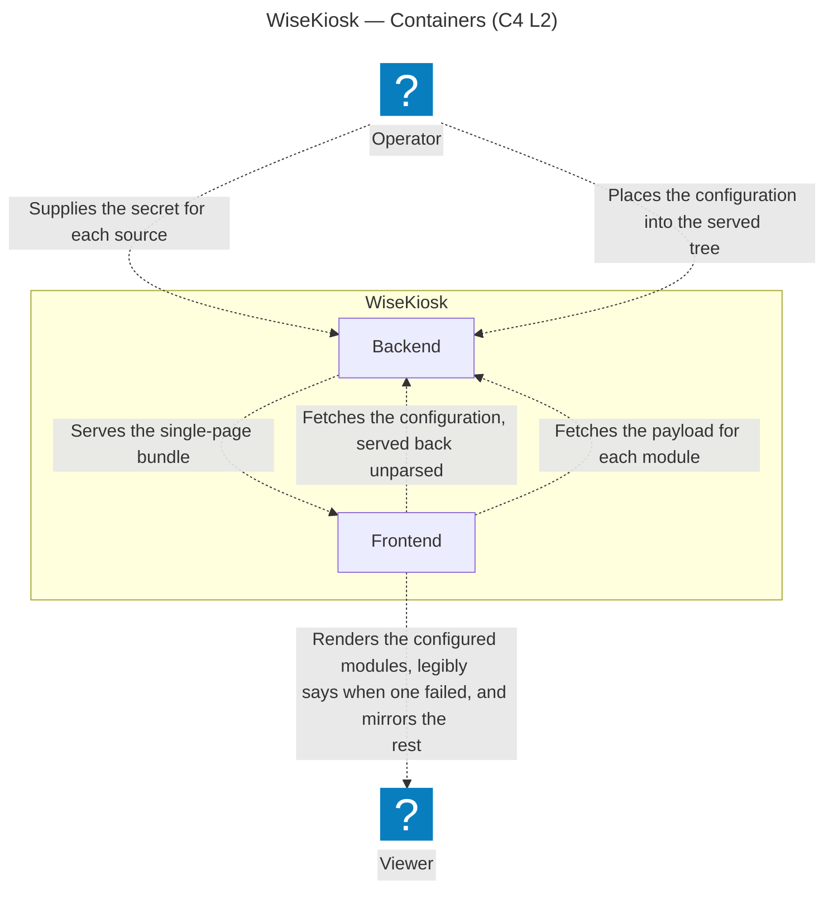
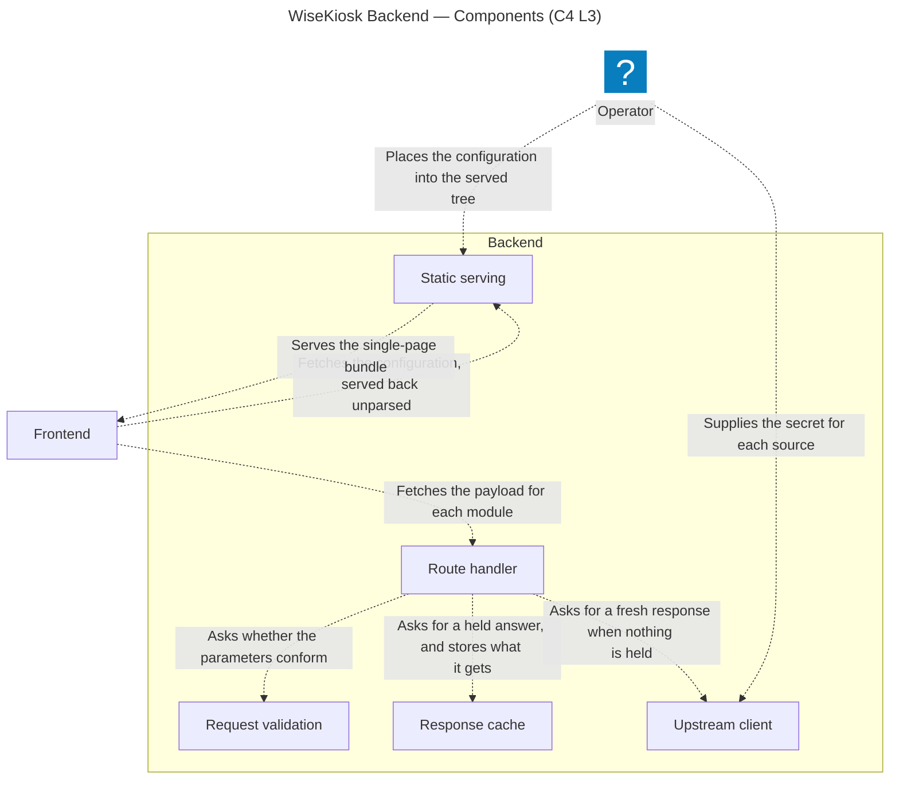
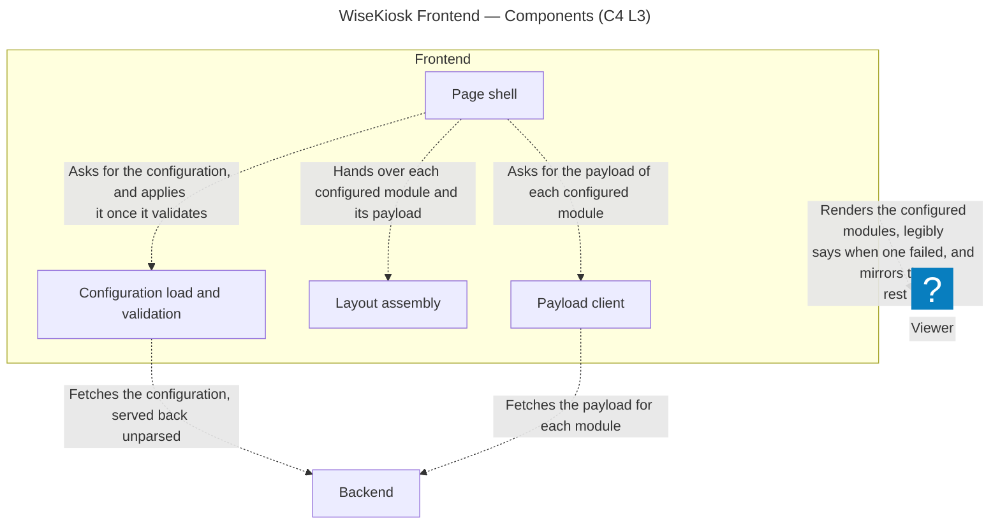
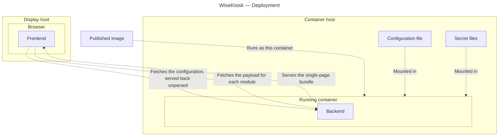

# Architecture

How the pieces of WiseKiosk actually fit together — the living structural description of the system
**as built**. It grows with the code.

> **Status: modelled, not built.** No code exists yet, so the narrative sections below carry
> _To be documented as it is built._ and stay empty until their part lands. The diagrams are the
> exception: they are generated from the [architecture model](architecture/README.md), which is
> normative for structure ([ADR 0003 rev 2](decisions/0003-architecture-as-code-likec4.md)), and the
> prose beside each one carries what `codegen mermaid` drops from it. What a component must *do* is
> normative in the [requirements tree](requirements/README.md) and the
> [ADRs](decisions/README.md), and is cited here rather than restated. This document also holds
> structural rationale that is real but not weighty enough for an ADR.

## System shape

One published container image serving a full-screen, config-driven smart-mirror display. A Go
backend proxies a handful of public APIs and serves the built frontend
([ADR 0019 rev 4](decisions/0019-boundary-at-what-deploys-and-tag-tier.md)); a Svelte SPA renders
modules into regions of the page. See the [README](../README.md) for the product definition, and
SYS002<!-- The display's rendering keeps nothing from a viewer -->,
SYS004<!-- Upstream data reaches the display only through the backend --> and
SYS005<!-- Single-definition internal contract --> with their SRS children in the [requirements
tree](requirements/README.md) for the intended architecture until this section describes the built
one. The frontend's static-bundle shape is not a need: it is a repository check, in
[`CI.md`](CI.md).

The diagram below is **generated from the validated [LikeC4 model](architecture/README.md)**, not
drawn by hand — edit `docs/architecture/model/` and run `just arch-export`, which regenerates every
Mermaid artifact in [`docs/architecture/generated/`](architecture/generated/) and splices each
between its marker comments (`scripts/splice-arch-diagrams.mjs`). Hand edits inside a marker region
are overwritten on the next export, and drift fails the staleness gate — see the
[architecture README](architecture/README.md) for the workflow.

**System context (C4 L1)** — the Operator who deploys and configures WiseKiosk, the Viewer it renders
for, and the boundary between them, which is what deploys: the published image and what it serves
([ADR 0019 rev 4](decisions/0019-boundary-at-what-deploys-and-tag-tier.md)). No external system
appears at this level: an upstream data source is modelled once the module that reads it has a need
in the tree ([ADR 0019 rev 4](decisions/0019-boundary-at-what-deploys-and-tag-tier.md)).

<!-- arch-export:begin generated/index.mmd -->

<!-- arch-export:end generated/index.mmd -->

**Containers (C4 L2)** — what runs inside the boundary. Two things run: the backend process, and the
frontend bundle executing in the browser on the display host. They share one origin, because the
backend serves that bundle and the configuration file as static content it never interprets
([ADR 0019 rev 4](decisions/0019-boundary-at-what-deploys-and-tag-tier.md),
[ADR 0007 rev 2](decisions/0007-config-validation-allocation.md)). What parameterises a deployment
(SYS003<!-- A deployment is parameterised from outside the image -->) reaches that filesystem as two
separate supplies: the secret for each source, resolved per request
(SRS006<!-- Unresolvable secret surfaces as that source's upstream failure -->), and the
configuration, which the image does not carry
(SRS018<!-- One generic published image -->) and which reaches its consumer on a second hop, when the
page fetches it. No upstream source appears here for the reason none appears above: an upstream
belongs to the module that reads it, and no module need is written
([ADR 0019 rev 4](decisions/0019-boundary-at-what-deploys-and-tag-tier.md)).

<!-- arch-export:begin generated/containers.mmd -->

<!-- arch-export:end generated/containers.mmd -->

The Component level (C4 L3) is drawn per container, in the two container sections below, and the
Deployment level in [§ Deployment](#deployment). No element carries a `link` to the source
implementing it: no code exists, and the repository layout is #5 repo layout.

**Every accepted, active `SYS` or `SRS` item binds somewhere in this model, and where one cannot, the
model grows to draw what it obliges**
([ADR 0019 rev 4](decisions/0019-boundary-at-what-deploys-and-tag-tier.md)). There is no exemption record:
an item bound nowhere is a level this model has not drawn yet, not a case to register. An item still
`proposed` is outside the rule rather than exempt from it, since `check-arch-trace` resolves a tag only
to an accepted item; a retired item is out for the same reason it obliges nothing, and retirement is
`active: false` with `status` left alone, so *accepted* does not imply *active*. The `TST` tier is
outside it too: a verification item says how an obligation is settled, not what the software owes.

**Which items are unbound is the check's answer, not this document's.** The second direction of
`check-arch-trace` enumerates them; a roster written here would be a point-in-time inventory nothing
compares to the tree, and it is wrong from the first binding that lands after it. The **kind** of
absence is what a reader needs, and there is one: an item whose subject the model does not draw at
all. That is a reason to grow the model, never to register an exemption
([ADR 0019 rev 4](decisions/0019-boundary-at-what-deploys-and-tag-tier.md)), and the worked example is
the published image: neither container nor component, so the obligations on it sit at the Deployment
level, which is the level drawn to carry them.

## Backend

_To be documented as it is built._ Language and boundary-contract decision:
[ADR 0001 rev 1](decisions/0001-backend-language-go.md); the backend's config-blindness is
[ADR 0007 rev 2](decisions/0007-config-validation-allocation.md)'s. What the backend must do is the
[requirements tree](requirements/README.md); which obligations bind this container is the
[architecture model](architecture/README.md), as each is modelled (#119 C4 model completion).
Neither is restated here.

**Components (C4 L3)** — the backend's framework half: a route handler owning the order things happen
in, and beneath it what checks a request's parameters before any upstream call, what holds an answer,
what goes out for a new one, and what serves files. Nothing here reads who is asking
(SRS009<!-- Every source reachable through the backend, statelessly -->), which is why the parameter
check exists: it holds the set of upstream requests the backend can be made to issue to the set its
configuration calls for
(SYS004<!-- Upstream data reaches the display only through the backend -->), whoever is asking; a
request that does not conform is refused with a status distinct to its cause and a body the frontend
can render (SRS013<!-- Client-facing contract for rejected requests -->). What holds an answer keeps a
route's last success and its last failure, each for the interval that route's entry sets, and what
serves files re-reads the configuration from the served tree on each request for it, which is why a
configuration change needs no rebuild
(SRS003<!-- A configuration change applies no later than the next page load -->). A module's own half of this
container is its shaping library, drawn when that module's need lands
([ADR 0019 rev 4](decisions/0019-boundary-at-what-deploys-and-tag-tier.md)); the handler
calls it twice — to build the upstream request and to parse the answer — so what is drawn here cannot
serve a payload on its own. A route's parameter validation, its two cache TTLs, its rate limit, its
outbound timeout and its maximum response size are one entry in a static registration list and live
nowhere else
([the module contract](contracts/module-contract.md)); that entry is data these components read
rather than a component of its own.

<!-- arch-export:begin generated/backendComponents.mmd -->

<!-- arch-export:end generated/backendComponents.mmd -->

## Frontend

_To be documented as it is built._ Svelte 5 + Vite, a static single-page bundle served as static
files ([ADR 0018 rev 1](decisions/0018-frontend-svelte-vite-static-spa.md)); each module's poll cadence is
that module's own need, per
[the module contract](contracts/module-contract.md); configuration
validation is frontend-owned per [ADR 0007 rev 2](decisions/0007-config-validation-allocation.md).
What the display page must do is the [requirements tree](requirements/README.md); which obligations
bind this container is the [architecture model](architecture/README.md), as each is modelled
(#119 C4 model completion). Neither is restated here.

**Components (C4 L3)** — the frontend's framework half: a page shell owning the order things happen
in, which renders before any configuration is applied, and beneath it the load-and-validate step, the
fetch of each module's payload, and the assembly of configured modules into their regions. Assembly
places what it is handed and fetches nothing, which is the discipline the module contract puts on a
module component applied one level up. It also holds every region out of the masked band along the
display's edges, at the depth the configuration declares and none where it declares nothing
(SRS034<!-- The laid-out regions keep clear of the display edge -->,
SRS035<!-- The masked edge band is the deployment's to declare -->), reflows rather than overlapping
or scrolling sideways at narrower viewports
(SRS017<!-- Full-screen assembly at kiosk; reflow, no horizontal scroll, at narrower widths -->), and
lets content exceeding its region overflow rather than be clipped, scrolled or scaled
(SRS031<!-- Content too large for its region overflows -->). The payload fetch distinguishes a backend
that cannot be reached from a module that failed, so the display says the former once rather than
five times (SRS026<!-- The display says when the backend is gone -->).

What the container owes across all of them is the mirror it is made of: everything the page draws but
the content itself sits under one emission ceiling
(SRS030<!-- Only content is rendered above the emission ceiling --> under
SYS008<!-- The surface carrying no content is a mirror -->), and the text it presents to be read is
rendered at full emission (SRS032<!-- Readable text is carried at full emission -->) and above a size
floor read against the display's height
(SRS033<!-- Text holds a minimum size against the display, at every resolution -->). Those are
properties of the assembled page rather than of any one component, which is why they bind on the
container. A module's own half of this container is its Svelte component,
drawn when that module's need lands
([ADR 0019 rev 4](decisions/0019-boundary-at-what-deploys-and-tag-tier.md)) — which is why
the edge to the Viewer leaves this container rather than a region within it. The bundle that becomes
this container arrives on the one edge drawn server-to-client, which terminates on the container
rather than on a child because no component exists to fetch what has yet to run; `include *` does not
reach it, so this view alone omits where the bundle comes from, and the Backend's view above is where
it is drawn.

<!-- arch-export:begin generated/frontendComponents.mmd -->

<!-- arch-export:end generated/frontendComponents.mmd -->

## The boundary contract

One schema definition, both sides generated from it — the load-bearing structural constraint of the
whole system (SYS005<!-- Single-definition internal contract -->,
SRS015<!-- One schema, all boundary value classes -->–SRS016<!-- Both sides consume the generated types -->,
[ADR 0001 rev 1](decisions/0001-backend-language-go.md)). The codegen mechanism is
[ADR 0008 rev 1](decisions/0008-boundary-contract-openapi-codegen.md): a single hand-authored OpenAPI
schema (3.0.3, with 3.1 the stated migration target), owned by neither package, with Go types
generated by `oapi-codegen` and TypeScript types by `openapi-typescript`, kept honest by a CI drift
gate that regenerates both
sides and fails on any difference. The schema owns every value that crosses the boundary — request
parameters, success payloads, the structured upstream-failure and client-error rejection bodies, and
the status codes the frontend discriminates on.

_The concrete wiring — where the schema file lives, the generate step, the drift-check workflow — is
documented here once it is built (#7, after the repo layout in #5)._

## Config and secrets

_To be documented as it is built._ The backend is config-blind, per
[ADR 0007 rev 2](decisions/0007-config-validation-allocation.md), which also states byte-for-byte delivery
to the page; the configuration is a static file bind-mounted into the served tree
(SRS018<!-- One generic published image -->), validated in the page and nowhere else
([ADR 0007 rev 2](decisions/0007-config-validation-allocation.md)) at apply time, where a
module-scoped error is reported at that module
(SRS002<!-- A module-scoped configuration error is reported at that module -->). A secret reaches the
backend only as the file named by `<NAME>_FILE` — never through configuration, and never through a
bare `<NAME>` environment variable (SRS007<!-- Configuration schema offers no secret-bearing key -->).

## Deployment

**Deployment** — what the project publishes, the hosts that run it, and the files the operator places
beside them ([ADR 0019 rev 4](decisions/0019-boundary-at-what-deploys-and-tag-tier.md)). It is not
one of C4's four core levels: C4's fourth is Code, and deployment is a supplementary diagram mapping
containers onto the infrastructure they run on.

<!-- arch-export:begin generated/deployment.mmd -->

<!-- arch-export:end generated/deployment.mmd -->

The published image is the one node here that exists before any deployment does — the configuration
and the secret files sit at a deployment site as it does not — and it is drawn because the obligations
on it are obligations on the artifact rather than on the process it becomes. A deployment can override
what the image declares, which is why the two are separate subjects
([ADR 0019 rev 4](decisions/0019-boundary-at-what-deploys-and-tag-tier.md)). It carries the backend
binary and the frontend bundle, is built for each architecture it supports
(SRS019<!-- The backend runs on both supported architectures -->), declares the user the backend runs
as (SRS020<!-- Non-root container user -->), and holds no configuration file, no secret material and
no deployment-specific value (SRS018<!-- One generic published image -->,
SRS025<!-- No secret material in the published image -->). The operator's configuration file carries
every deployment-specific value instead, the masked band's depth among them
(SRS035<!-- The masked edge band is the deployment's to declare -->).

The container host and the display host are **roles, not machines**. They have different floors — a
runtime able to run the published image on one, a browser on the other — and one machine meeting both
may carry both. In the configuration this is built for it cannot: the display host is below the first
of those, so the two are separate machines there. Which architectures the container host must be one
of is the image's property rather than the host's, the backend never running outside the container;
neither host carries a requirement tag, because what the software must run on binds on what this
project ships and not on hardware the operator supplies
([ADR 0019 rev 4](decisions/0019-boundary-at-what-deploys-and-tag-tier.md)). What bounds the frontend
is the browser there: its engine and compatibility layers decide what that bundle may be built with.

The concrete wiring — the deployment recipe, the mount paths, the example configuration a release
carries — is [`DEPLOYMENT.md`](DEPLOYMENT.md)'s, and so are the health signal and the restart policy:
each is a property of what ships rather than of the running system.

## Security & hardening

Product-facing obligations are carried by the [requirements tree](requirements/README.md): the image
properties the product owes (SRS018<!-- One generic published image -->,
SRS025<!-- No secret material in the published image -->, SRS020<!-- Non-root container user -->)
under SYS003<!-- A deployment is parameterised from outside the image --> and
SYS006<!-- Neither grant privilege nor require it -->, and the served response's browser hardening
(SRS010<!-- The display page reaches no origin but the backend's -->,
SRS027<!-- The display page holds no device capability it does not use -->,
SRS028<!-- Served responses declare their type, and forbid the browser inferring one -->) under
SYS004<!-- Upstream data reaches the display only through the backend --> and
SYS006<!-- Neither grant privilege nor require it -->, each with TST verification items.
Published-artifact supply-chain integrity is not a requirement — it is material CI produces,
described in [`CI.md`](CI.md). Repository-facing gates — first-party and dependency scanning, image
scanning, and verify-CI parity — are [`CI.md`](CI.md)'s; no requirement states them.

The posture **already enforced** (branch protection: all six checks required — `docs-and-hygiene`,
`secret-scan`, `process`, `requirements`, `architecture`, `docs-site` — strict, admins bound; secret
scanning with push protection, SHA-pinned Actions, least-privilege `GITHUB_TOKEN`, Dependabot for the
Actions ecosystem) lives in `.github/` and the repo's branch-protection settings. What each of those
asserts is [`CI.md`](CI.md)'s: the action pins, the top-level token grants and the Actions ecosystem
entry are gated there, and secret scanning with push protection is recorded there as configuration no
workflow token can read.
