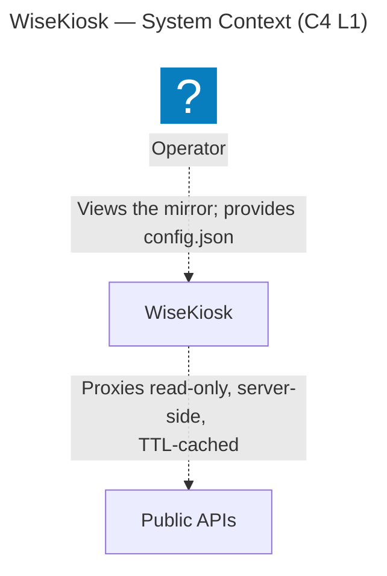
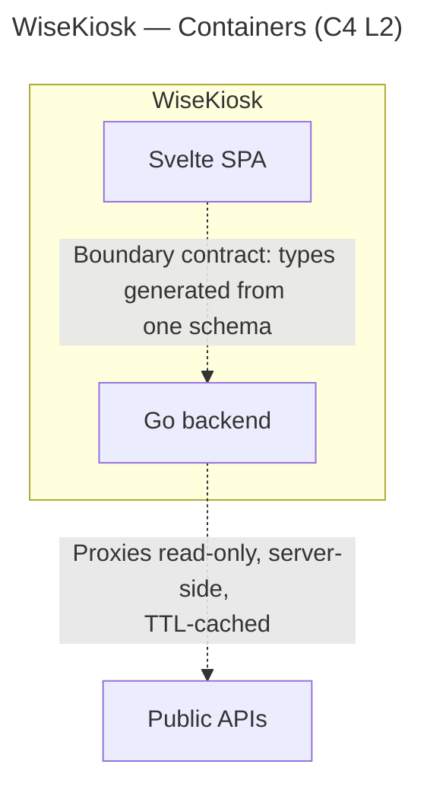

# Architecture

How the pieces of WiseKiosk actually fit together — the living structural description of the system
**as built**. It grows with the code.

> **Status: skeleton.** No code exists yet. Until a component is built, the *intended* shape lives in
> [`FOUNDATIONS.md`](FOUNDATIONS.md) §3 (day-one architecture), which is a design hypothesis, not a
> description of running code. This document records what is actually implemented, and structural
> rationale that is real but not weighty enough for an [ADR](decisions/README.md). Each section below
> is filled in as its part of the system lands.

## System shape

One published container image serving a full-screen, config-driven smart-mirror display. A Go backend
proxies a handful of public APIs and serves the built frontend; a Svelte SPA renders modules into
regions of the page. See [`FOUNDATIONS.md`](FOUNDATIONS.md) §1 for the product and §3 for the intended
architecture until this section describes the built one.

The diagrams below are **generated from the validated [LikeC4 model](architecture/README.md)**, not
drawn by hand — edit `docs/architecture/model/` and run `just arch-export`, which regenerates the
Mermaid artifacts in [`docs/architecture/generated/`](architecture/generated/) and splices them
between the marker comments below (`scripts/splice-arch-diagrams.mjs`). Hand edits inside a marker
region are overwritten on the next export, and drift fails the staleness gate — see the
[architecture README](architecture/README.md) for the workflow.

**System context (C4 L1)** — the Operator, the WiseKiosk system, and the public APIs it proxies:

<!-- arch-export:begin generated/index.mmd -->

<!-- arch-export:end generated/index.mmd -->

**Containers (C4 L2)** — inside WiseKiosk: the Go backend and the Svelte SPA, the boundary contract
between them (one schema, both sides generated), and the backend's outbound API calls:

<!-- arch-export:begin generated/containers.mmd -->

<!-- arch-export:end generated/containers.mmd -->

## Backend

_To be documented as it is built._ Language and boundary-contract decision:
[ADR 0001](decisions/0001-backend-language-go.md). Intended shape: stateless REST proxy with a
TTL response cache, config schema validation, and static file serving (FOUNDATIONS §3).

## Frontend

_To be documented as it is built._ Svelte 5 + Vite static SPA; payload types generated from the
boundary schema, never hand-declared (FOUNDATIONS §4, §6).

## The boundary contract

_To be documented once the codegen mechanism is chosen (open question 2)._ One schema definition,
both sides generated from it. This is the load-bearing structural constraint of the whole system —
see [ADR 0001](decisions/0001-backend-language-go.md).

## Config and secrets

_To be documented as it is built._ Frontend owns `config.json`; the backend owns no config file and
validates-then-serves it verbatim. Secrets delivered via `<NAME>_FILE`/`<NAME>`, never through config
(FOUNDATIONS §3).

## Deployment

_To be documented as it is built._ Container image, bind-mounted config, `_FILE` secrets, fixed-port
healthcheck, `unless-stopped` (FOUNDATIONS §3).

## Security & hardening backlog

Forward-looking gates and controls to wire up **as the code and container land**. Nothing here is a
current defect — each is a control with no artifact to attach to yet. Each row is written to become a
**testable requirement**: a future session can lift these into tickets, and each converts into an
obligation in [`TESTING.md`](TESTING.md) as it lands. That framing is deliberate — a hardening control
with no test that proves it *functions* is the "security by vigilance" this project rejects
(FOUNDATIONS §5); a control is done when a test would fail if it regressed.

That proto-traceability is now mechanised in the [Doorstop requirements tree](requirements/README.md):
a row here graduates into an `SRS` "shall" statement and a `TST` verification item whose `references`
point at the proving artifact, gated by `just check-reqs`. The load-bearing invariants already seeded
are the worked template — documentation is self-contained
([`SYS001`](requirements/sys/SYS001.yml) → [`SRS001`](requirements/srs/SRS001.yml) →
[`TST001`](requirements/tst/TST001.yml)), boundary values generated from one schema
([`SRS005`](requirements/srs/SRS005.yml)), and secrets never leaking by construction
([`SRS006`](requirements/srs/SRS006.yml)) — and the remaining rows below join them as their code lands.

The posture **already enforced** (branch protection with required review + checks, secret scanning +
push protection, SHA-pinned Actions, least-privilege `GITHUB_TOKEN`, secret-free CI, Dependabot for
Actions) lives in `.github/` and the repo's branch-protection settings, not in this backlog.

| Control | Applies once | Verified by |
|---|---|---|
| **CodeQL / code scanning** (Go + Svelte/TS) | first backend or frontend code exists | scanning workflow runs on every PR; a seeded finding surfaces as a required check |
| **Lint in CI, blocking** (`golangci-lint`; `eslint` / `svelte-check`) | first code in each package | CI job fails on a seeded lint violation |
| **Dependency CVE gates** (`govulncheck`; `npm audit`) | `go.mod` / `package.json` exist | CI fails on a known-vulnerable pinned dependency in a test |
| **Dependabot `gomod` + `npm` ecosystems** | those manifests exist | grouped update PRs appear for each ecosystem |
| **Container: non-root `USER`** | a Dockerfile exists | image runs as a non-root uid (asserted in an image test) |
| **Container: digest-pinned base image**, kept fresh | a Dockerfile exists | base reference is a `@sha256:` digest; Dependabot bumps it |
| **Container: `HEALTHCHECK`** on the fixed port | a Dockerfile exists | an integration test hits the endpoint; orchestrator restarts on unhealthy |
| **Container: `.dockerignore`** excludes `.git`, secrets, `node_modules` | a Dockerfile exists | build context excludes them (asserted against the context) |
| **Container image scan** (`trivy` / `grype`) as a CI gate | the image builds in CI | scan job fails on a seeded high-severity finding |
| **Publish integrity**: SBOM (`syft`), build-provenance attestation, `cosign` signing | the image is published | signature + provenance verify; SBOM attached to the release |
| **Runtime: CSP `connect-src 'self'`** + standard security headers | the backend serves the frontend | response headers asserted in an integration test |
| **Runtime: constant bind + route rate-limiting** (FOUNDATIONS §3) | routes exist | rate limit returns 429 past threshold in a test; bind address is a constant, not a config key |
