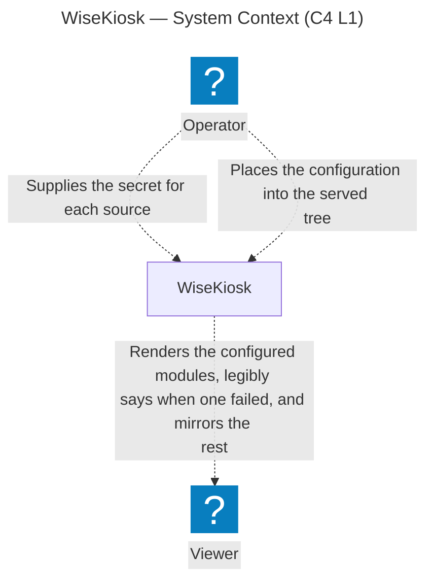
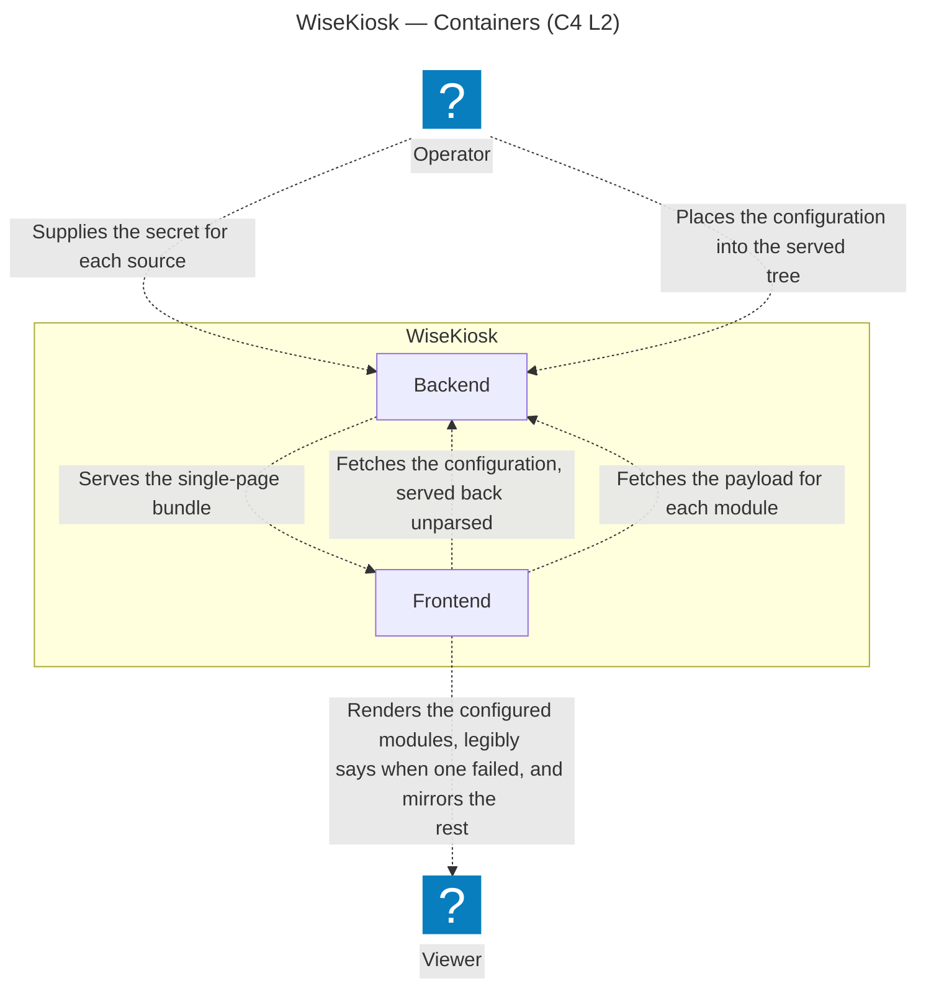
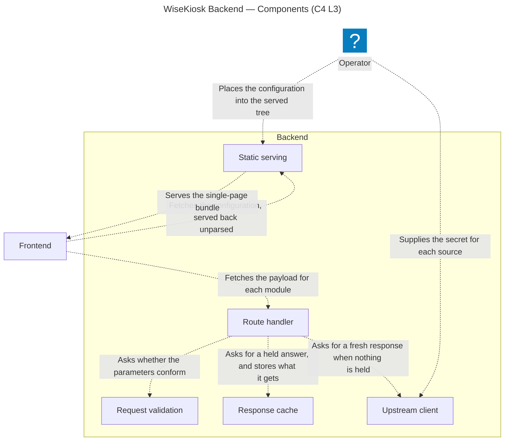
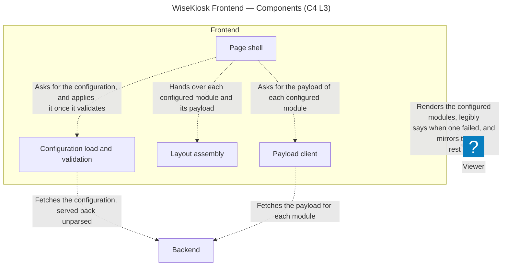
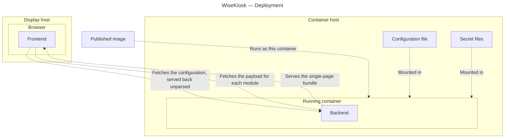

# Architecture

The living structural description of WiseKiosk **as built**. It grows with the code.

> **Status: modelled, not built.** No code exists, so the narrative sections carry _To be documented as
> it is built._ until their part lands. The diagrams are the exception: they are generated from the
> [architecture model](architecture/README.md), which is normative for structure
> ([ADR 0003 rev 2](decisions/0003-architecture-as-code-likec4.md)). What `codegen mermaid` drops —
> element descriptions, icons — is read in that model, and an element's responsibility statement stays
> there rather than being copied beside it. What a component must *do* is the
> [requirements tree](requirements/README.md) and the [ADRs](decisions/README.md). This document holds
> structural rationale too light for an ADR, and cites the rest.

## System shape

One published container image serving a full-screen, config-driven smart-mirror display: a Go backend
proxying public APIs and serving the built frontend, and a Svelte SPA rendering modules into regions of
the page ([ADR 0019 rev 5](decisions/0019-boundary-at-what-deploys-and-tag-tier.md)). The product
definition is the [README](../README.md); the intended architecture until this section describes the
built one is SYS002<!-- The display's rendering keeps nothing from a viewer -->,
SYS004<!-- Upstream data reaches the display only through the backend --> and
SYS005<!-- Single-definition internal contract --> with their SRS children. The frontend's static-bundle
shape is a repository check, in [`CI.md`](CI.md), rather than a need.

Those two containers project onto two package roots — `backend/` and `frontend/` — with the one
boundary schema at `boundary/openapi.yaml` because it belongs to neither, and the release material in
`deploy/` because it is outside the boundary
([ADR 0021 rev 1](decisions/0021-repository-layout.md)).

Every diagram below is **generated from the validated [LikeC4 model](architecture/README.md)**, not
drawn by hand. Edit `docs/architecture/model/` and run `just arch-export`, which regenerates each
Mermaid artifact and splices it between its marker comments; a hand edit inside a marker region is
overwritten on the next export, and drift fails the staleness gate. The workflow is the
[architecture README](architecture/README.md)'s.

**System context (C4 L1)** — the Operator who deploys and configures WiseKiosk, the Viewer it renders
for, and the boundary between them, which is what deploys: the published image and what it serves. No
external system appears, an upstream data source being modelled once the module that reads it has a need
in the tree ([ADR 0019 rev 5](decisions/0019-boundary-at-what-deploys-and-tag-tier.md)).

<!-- arch-export:begin generated/index.mmd -->

<!-- arch-export:end generated/index.mmd -->
**Containers (C4 L2)** — what runs inside the boundary: the backend process, and the frontend bundle
executing in the browser on the display host. They share one origin, because the backend serves that
bundle and the configuration file as static content it never interprets
([ADR 0019 rev 5](decisions/0019-boundary-at-what-deploys-and-tag-tier.md),
[ADR 0007 rev 2](decisions/0007-config-validation-allocation.md)). What parameterises a deployment
(SYS003<!-- A deployment is parameterised from outside the image -->) reaches that filesystem as two
separate supplies: the secret for each source, resolved per request
(SRS006<!-- Unresolvable secret surfaces as that source's upstream failure -->), and the configuration,
which the image does not carry (SRS018<!-- One generic published image -->) and which reaches its
consumer on a second hop, when the page fetches it. No upstream source appears here for the reason none
appears above.

<!-- arch-export:begin generated/containers.mmd -->

<!-- arch-export:end generated/containers.mmd -->
The Component level (C4 L3) is drawn per container, in the two sections below, and the Deployment level
in [§ Deployment](#deployment). No element carries a `link` to the source implementing it, no code
existing; where that source sits when it lands is
[ADR 0021 rev 1](decisions/0021-repository-layout.md).

**Every accepted, active `SYS` or `SRS` item binds somewhere in this model, and where one cannot, the
model grows to draw what it obliges** — there is no exemption record, and which items are unbound is
`check-arch-trace`'s answer rather than this document's
([ADR 0019 rev 5](decisions/0019-boundary-at-what-deploys-and-tag-tier.md)). The **kind** of absence is
what a reader needs, and there is one: an item whose subject the model does not draw at all. The worked
example is the published image — neither container nor component, so the obligations on it sit at the
Deployment level, which is the level drawn to carry them.

## Backend

_To be documented as it is built._ Its source root is `backend/`, the Go module root, holding the shared
framework under `internal/` and each upstream-backed module's shaping library under
`internal/modules/<name>/` ([ADR 0021 rev 1](decisions/0021-repository-layout.md)). Language and
boundary-contract decision: [ADR 0001 rev 1](decisions/0001-backend-language-go.md); config-blindness:
[ADR 0007 rev 2](decisions/0007-config-validation-allocation.md). What the backend must do is the
[requirements tree](requirements/README.md); which obligations bind this container is the
[architecture model](architecture/README.md), as each is modelled (#119 C4 model completion). Neither is
restated here.

**Components (C4 L3)**, diagrammed below; each box's responsibility is the model's, not restated here.
A module's own half of this container is its shaping library, drawn when that module's need lands
([ADR 0019 rev 5](decisions/0019-boundary-at-what-deploys-and-tag-tier.md)); the route handler calls
it twice — to build the upstream request and to parse the answer — so what is drawn here cannot serve
a payload on its own. A route's policies — parameter validation, both cache TTLs, rate limit, outbound
timeout, maximum response size — are one entry in the static registration list and live nowhere else
([the module contract](contracts/module-contract.md)); that entry is data these components read rather
than a component of its own.

<!-- arch-export:begin generated/backendComponents.mmd -->

<!-- arch-export:end generated/backendComponents.mmd -->

**Cache and rate-limit defaults.** These are the defaults each route's registration entry carries for
the cache and rate-limit policies named above, chosen once here with the reasoning behind them. A
route refines them against its source — the success-response TTL paired with that module's poll cadence
([the module contract](contracts/module-contract.md)) — but they are code constants, not
configuration: the bound they hold is SRS011's<!-- Upstream request rate is bounded, and the bound is not operator-tunable -->, which forbids raising it from outside the image.

- **Success-response cache TTL — 10 minutes.** The fresh end of the display's tolerance for stale
  data. A `(source, query)` reaches upstream at most once per TTL however many clients ask and however
  often; on a route serving few distinct queries, the TTL — not the route-global rate limit — is what
  principally holds the upstream request rate down.
- **Negative-response cache TTL — 60 seconds.** Shorter than the success TTL, so a transient upstream
  failure clears within about a minute of the source recovering, yet long enough that a burst of
  requests during an outage collapses to one retry per minute against a source already failing.
- **Per-route rate limit — 10 requests per minute.** A route-global ceiling on requests that reach
  upstream; a cache hit is neither counted against it nor rejected. Steady state is roughly one
  upstream fetch per TTL, so the ceiling sits well above legitimate traffic — headroom for several
  clients missing cache together at start-up — while still rejecting a client stuck in a fast retry
  loop. It reinforces the TTL bound rather than replacing it.

These values cannot be proven against a source until one exists; each is a starting default a module
revisits when its upstream lands.

## Frontend

_To be documented as it is built._ Its source root is `frontend/`, the npm package root, holding the
framework half under `src/lib/`, each module's component and configuration-schema fragment under
`src/modules/<name>/`, and the configuration schema those fragments compose into under `src/config/`
([ADR 0021 rev 1](decisions/0021-repository-layout.md)). Svelte 5 + Vite, a static single-page bundle
served as static files ([ADR 0018 rev 1](decisions/0018-frontend-svelte-vite-static-spa.md)); each
module's poll cadence is that module's own need
([the module contract](contracts/module-contract.md)); configuration validation is frontend-owned
([ADR 0007 rev 2](decisions/0007-config-validation-allocation.md)). What the display page must do is the
[requirements tree](requirements/README.md); which obligations bind this container is the
[architecture model](architecture/README.md), as each is modelled (#119 C4 model completion). Neither is
restated here.

**Components (C4 L3)**, diagrammed below; each box's responsibility is the model's, not restated here.
A module's own half of this container is its Svelte component, drawn when that module's need lands
([ADR 0019 rev 5](decisions/0019-boundary-at-what-deploys-and-tag-tier.md)), which is why the edge to
the Viewer leaves this container rather than a region within it. Assembly's discipline — placing what
it is handed, fetching nothing — is the module contract's rule for a module component, applied one
level up. The bundle that becomes this container arrives on the one edge drawn server-to-client,
terminating on the container rather than on a child because no component exists to fetch what has yet
to run; `include *` does not reach it, so this view alone omits where the bundle comes from, and the
Backend's view above is where it is drawn.

<!-- arch-export:begin generated/frontendComponents.mmd -->

<!-- arch-export:end generated/frontendComponents.mmd -->
## The boundary contract

One schema definition, both sides generated from it — the load-bearing structural constraint of the
whole system (SYS005<!-- Single-definition internal contract -->,
SRS015<!-- One schema, all boundary value classes -->–SRS016<!-- Both sides consume the generated types -->,
[ADR 0001 rev 1](decisions/0001-backend-language-go.md)). The mechanism is
[ADR 0008 rev 2](decisions/0008-boundary-contract-openapi-codegen.md): one hand-authored OpenAPI schema
(3.0.3, with 3.1 the stated migration target), owned by neither package, Go types generated by
`oapi-codegen` and TypeScript types by `openapi-typescript`, kept honest by a CI drift gate that
regenerates both sides and fails on any difference. The schema owns every value crossing the boundary —
request parameters, success payloads, the structured upstream-failure and client-error rejection bodies,
and the status codes the frontend discriminates on.

The one schema is `boundary/openapi.yaml`, and the types generated from it are committed inside the
package that compiles them ([ADR 0021 rev 1](decisions/0021-repository-layout.md)). What the drift
gate asserts, and what it leaves unproven, is [`CI.md`](CI.md) § *Generated boundary types*.

The generate step reads that one file twice. `oapi-codegen`, pinned by the Go module's `tool`
directive and configured for types only, emits `backend/internal/boundary/`; `openapi-typescript`,
pinned to an exact version in the frontend package, emits `frontend/src/lib/boundary/`. Neither
generator knows about the other, and neither package's build reaches across — what the two sides
share is the schema and nothing else, which is the whole of the arrangement. `just codegen` runs
both; `just check-boundary` clears the two generated directories, runs both again and fails on any
difference against what is committed, so the committed types cannot drift from the schema without a
gate saying so. The error bodies the schema carries are
[ADR 0026 rev 1](decisions/0026-boundary-error-body-shape.md)'s; a module's payload joins them as a
named component of the same file.

## Config and secrets

_To be documented as it is built._ The backend is config-blind and delivers the configuration
byte-for-byte to the page ([ADR 0007 rev 2](decisions/0007-config-validation-allocation.md)); the
configuration is a static file bind-mounted into the served tree
(SRS018<!-- One generic published image -->), validated in the page and nowhere else at apply time,
where a module-scoped error is reported at that module
(SRS002<!-- A module-scoped configuration error is reported at that module -->). A secret reaches the
backend only as the file named by `<NAME>_FILE`, never through a bare `<NAME>` environment variable
([ADR 0024 rev 1](decisions/0024-secret-file-delivery.md)) — and never through the configuration, which
offers no secret-bearing key (SRS007<!-- Configuration schema offers no secret-bearing key -->).

## Deployment

**Deployment** — what the project publishes, the hosts that run it, and the files the operator places
beside them ([ADR 0019 rev 5](decisions/0019-boundary-at-what-deploys-and-tag-tier.md)). It is not one
of C4's four core levels: C4's fourth is Code, and deployment is a supplementary diagram mapping
containers onto the infrastructure they run on.

<!-- arch-export:begin generated/deployment.mmd -->

<!-- arch-export:end generated/deployment.mmd -->
The published image is the one node here that exists before any deployment does, and it is drawn because
the obligations on it are obligations on the artifact rather than on the process it becomes. The
container host and the display host are **roles, not machines**, with different floors; in the
configuration this is built for they are necessarily separate machines. Why each of those is so, and why
a host carries a tag only where an item obliges the operator, is
[ADR 0019 rev 5](decisions/0019-boundary-at-what-deploys-and-tag-tier.md)'s.

The concrete wiring — the deployment recipe, the mount paths, the example configuration a release
carries — is [`DEPLOYMENT.md`](DEPLOYMENT.md)'s, and so are the health signal and the restart policy:
each is a property of what ships rather than of the running system.

## Security & hardening

Product-facing obligations are carried by the [requirements tree](requirements/README.md): the image
properties the product owes (SRS018<!-- One generic published image -->,
SRS025<!-- No secret material in the published image -->, SRS020<!-- Non-root container user -->) under
SYS003<!-- A deployment is parameterised from outside the image --> and
SYS006<!-- Neither grant privilege nor require it -->, and the served response's browser hardening
(SRS010<!-- The display page reaches no origin but the backend's -->,
SRS027<!-- The display page holds no device capability it does not use -->,
SRS028<!-- Served responses declare their type, and forbid the browser inferring one -->) under
SYS004<!-- Upstream data reaches the display only through the backend --> and
SYS006<!-- Neither grant privilege nor require it -->, each with TST verification items.

Everything else here is [`CI.md`](CI.md)'s and no requirement states it: published-artifact
supply-chain integrity, which is material CI produces; the repository-facing gates; the branch
protection that makes each gate job required, held there against the workflow rather than listed here;
and secret scanning with push protection, recorded there as configuration no workflow token can read.
