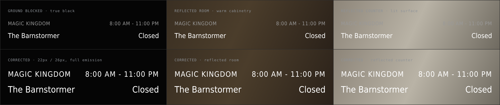
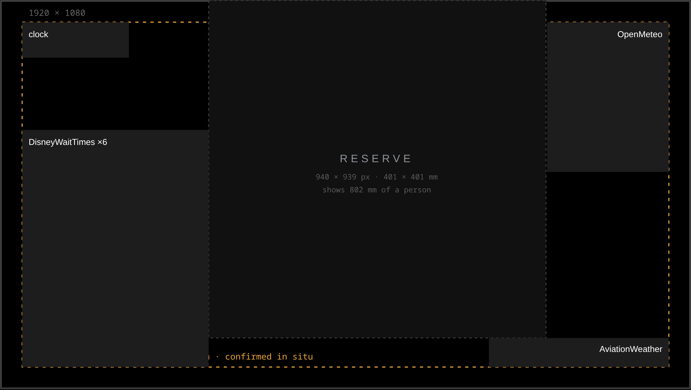

# Display design study — the mirror and the legibility floor

This is a design **study**, not a specification. It records what the deployed kiosk measurably is,
what photographs of it in situ proved that no stylesheet check could, and the calibration the two
display bounds are derived from. Nothing here is an obligation.

The normative obligations this study informs live in the requirements tree —
SYS008<!-- The surface carrying no content is a mirror -->,
SRS030<!-- Only content is rendered above the emission ceiling -->,
SRS032<!-- Readable text is carried at full emission -->,
SRS033<!-- Text holds a minimum size against the display, at every resolution -->,
SRS034<!-- The laid-out regions keep clear of the display edge --> and
SRS035<!-- The masked edge band is the deployment's to declare --> — each carrying its own rationale.
The design language they shape is the [display styling contract](../contracts/display-styling-contract.md), whose
**Calibrated bounds** section states the two figures this study derives (the type-size floor and the
emission ceiling) and is their canonical home. This document owns only the demonstrations and the
derivation.

## The governing constraint — additive only

Black is not a colour on this display. It is transparency. Behind one-way glass an unlit pixel is a
mirror, so the ground behind every character is whatever the room reflects at that point — a dark
cabinet, a lit countertop, a window, a person. The panel adds photons and can subtract none, which
removes every conventional legibility device at once: **no scrim behind text, no dark card under a
block, no shadow, no plate, no overlay.** Anything drawn to improve contrast is itself emitted light,
so it lifts the background rather than lowering it, and it costs mirror.

This was demonstrated rather than argued. A photograph of the kiosk at three feet, then a second from
the same position with the photographer's body interposed between the glass and the room's backlight,
render byte-identically in software. Where the body blocks the reflection the ground goes properly
black and the type is crisp; six inches away, over reflected cabinetry, the same type at the same size
and colour is mush. Two things follow, and they are the whole brief:

- **Contrast is not a property of the stylesheet.** A check comparing computed text colour against
  computed background scores both halves of that photograph 21:1 and never sees the failure.
- **The only lever is emitted light per character** — how bright, how large, how thick.

A third photograph, every room light on, is the condition the design must be sized against: the
reflected doorway is visibly brighter than the display's dim grey tiers, so there is no contrast ratio
to compute — the background is out-ranking the foreground, and the dimmest tier is not degraded there,
it is absent. And the reflection is *detailed* — cabinet edges, door panels, a picture frame. Thin
small text sits at roughly the spatial frequency of that clutter, so the two interfere and the glyphs
dissolve into the scene, while large forms survive the identical background at a scale the room does
not contain. Content has to differ from the room in **scale**, not only in brightness — which makes
tightening the type the exact wrong response to a legibility problem.

And where the bright reflection falls is luck: it moves with the room, the hour and where the viewer
stands. In the all-lights photograph it landed squarely on the six-park stack — the smallest,
thinnest and most numerous text on the display. Nothing in the design can rely on placement; a dim
tier cannot be parked where the reflection is dark, because where the reflection is dark is not
knowable.

## The same row, three grounds

Top row is the deployed treatment — 15 px at `#999`, weight 300 for the park and hours; 20 px at
weight 300 for the ride. Bottom row is the corrected treatment at full emission and a heavier stroke.
Read across, not down: the only variable is the ground.

The grounds are approximations of what the glass returns in the photographs, not measurements; the
demonstration is the ordering, which is unambiguous in the originals. The hours line is the first
thing to go on every ground, and it is the only line that is simultaneously the smallest, the dimmest
and the thinnest.

## The ink has one value

The deployed design carried five luminance steps: `#fff`, `#aaa`, `#999`, `#666`, and a dimmed seconds
counter. On a monitor that is a legitimate hierarchy. On a mirror it is a hierarchy of *how soon a
line disappears*, because a dimmed glyph is legible against dark reflection and absent against bright
reflection, and nothing in the software knows which is behind it.

**Content-bearing text emits at maximum luminance. There is no second step.** Hierarchy is carried
instead by what survives an uncontrolled background: **size** (the floor below), **weight** (stroke
thickness is photons per character — the deployed `font-weight: 300` is the worst available choice
here), **position** (what a region is, established by where it sits), and **scale separation** (content
must sit at a scale the reflected room does not contain). The corollary is a filter for the rebuild:
**if a datum does not warrant full luminance, it does not warrant space on a mirror.** Dimming is not
a cheap way to include something — it is a way to include it unreliably while still spending the
mirror.

## The legibility floor

ISO 9241-303 recommends 16 arcminutes minimum and 20–22 comfortable. It is the wrong yardstick — those
figures describe sustained reading of continuous text at a workstation. Two reports from the deployed
kiosk set the real floor, and the model reproduces both to within a few percent.

Modelled cap height in arcminutes, on the deployed 37″ visible image (461 mm tall, 1080 rows,
0.70 em cap height):

| Tier | 6 ft | 9 ft | 14 ft |
|---|---|---|---|
| clock / temperature · 65 px | 36.5′ | 24.3′ | 15.6′ |
| date · 30 px | 16.9′ | 11.2′ | 7.2′ |
| ride & wait · 20 px | 11.2′ | 7.5′ | 4.8′ |
| park & hours · 15 px | 8.4′ | 5.6′ | 3.6′ |

At 14 ft the clock reads at 15.6′ and nothing else exceeds 7.2′, which is exactly what the owner
reports. At 6 ft the smallest tier is 8.4′ and is called viewable — "fairly", which reads as the edge.
So the floor sits at that marginal edge — about **8½ arcminutes** at the nominal 6 ft — and the design
distance is **6 ft nominal, 9 ft outer bound**. A photograph from 9 ft confirms that outer bound is a
genuine edge rather than a comfortable margin — the weather block, the largest type on the screen, is
about all that survives it. Stated model-free so it survives any uncertainty in
panel geometry: at the deployed panel and 6 ft, **1.85 % of display height reads comfortably and
1.39 % is marginal**. Expressed as a fraction of display height the floor is resolution-independent —
it survives a 4K panel and an overscan change without a second set of figures, which the deployed
fixed-pixel design cannot. The styling contract's **Calibrated bounds** pins the operative figure at
that marginal end: the floor guarantees legibility, not comfort. Glanced meta-text — a unit, a
timestamp — is authored near it deliberately; sustained reading sits at the larger steps, well above.

## The mirror is the product

The largest contiguous unlit rectangle in the deployed layout is **940 × 939 px — a 401 × 401 mm
square, 42.6 % of the surface**; lit modules cover only 23 %. The photographs confirm what that buys:
a bright, sharp reflection of a person and the room at conversational distance. And the reserve is
computable rather than a matter of taste — a plane mirror of extent E shows an object of extent 2E,
**independent of viewing distance**, so 401 mm of reserve shows 802 mm of a person, head to roughly
the waist. A check can measure it from module geometry; the threshold is a decision about how much of
a person the product intends to show.

The reserve is a by-product of the four-corner composition rather than an intent. The park stack is
bottom-anchored and grows upward, so content volume — not viewport width — is what eventually eats it.
The dashed inset the figure marks *safe area · 5.6 %* is this installation's own bezel allowance, not
a design default: SRS035<!-- The masked edge band is the deployment's to declare --> makes the edge
band the deployment's to declare, and the styling contract defaults it to zero where none is supplied.

## What the two constraints do together

Legibility sets a floor under every element; the mirror sets a ceiling over all of them. Between them,
how much this display can carry stops being a matter of taste — though the answer is roomier than a
first pass suggested. The direction is forced by the optics: the mirror wants **vertical** extent,
because that is what shows a person's height, so content belongs in side columns rather than a
full-width band — the two constraints trade against each other in *width*, the dimension the mirror
has to spare.

The longest label, *Hagrid's Magical Creatures Motorbike Adventure™*, inks 396 px in the deployed
design and 667 px at a legible size in a heavier weight; a row carrying it needs roughly 620 px including its wait-time
column. A reserve sized for head and shoulders — half a shoulder span, about 550 px — leaves 625 px columns on both sides.
It fits, with little to spare. **Label length is a budget, not a prohibition:** long names cost column
width, which comes out of mirror width, the slack dimension — not mirror height, which is what
determines how much of a person the glass returns.

An earlier draft of this study asserted a 46-character label could not exist on this display. That was
wrong twice — it projected from the module's box rather than the string, inflating the requirement by
40 %, and it treated the 940 px reserve the deployed layout happens to leave as though it were the obligation.
The record is kept because a confident geometric impossibility is exactly the kind of claim that
survives unexamined into a rebuild.

The collision that eventually eats the reserve is not hypothetical. The deployed layout leaves a
200 px gap between the clock and the top of the park stack — one module of headroom; a seventh park,
or the compliments module the roster includes and this configuration omits, meets the clock. The
failure is already reproducible at 1280×800, not a future risk.

## What belongs in the specification

Nothing on this page is a requirement. The type scale, the composition, the weights and the reserve
size are one worked answer; a rebuild should be free to discard all of them. What the tree owes is the
properties they satisfy, with every threshold living in the check that measures it:

- **The surface is a mirror wherever it carries no information** — a need, not a decomposition of the
  layout need. Beneath it: the ground emits nothing, and a contiguous unlit region of sufficient
  extent survives every configuration.
- **Content-bearing text emits at the display's maximum luminance.** The reflected room is outside the
  system boundary, so the obligation is on what the software controls — its own emission.
- **Text meets a minimum size as a fraction of display height**, so the guarantee survives a change of
  panel or resolution.
- **Content stays within a safe-area inset**, which also subsumes the overflow collision: a stack
  growing upward meets the inset before it meets the clock.

All four are settled by a machine, unattended, from a rendered page — which is the finding that
matters most. The obligation was never a judgement obligation needing a new home; it was three or four
decidable clauses nobody had written down. The residue that genuinely cannot be verified — whether the
result is *handsome* — is preference rather than obligation, and is recorded as correctly absent.

---

**Sources.** A sample rendered headless at 1024×768, 1280×800, 1440×900, 1600×900, 1920×1080 and
3840×2160; sizes, colours, composited backgrounds and module geometry read from computed styles;
largest empty rectangle computed over module boxes. Angular figures assume a 37″ visible 16:9 image,
461 mm tall, and a 0.70 em cap height; the legibility floor is calibrated to the owner's reports at
14 ft and 6 ft rather than adopted from a standard. Five photographs of the kiosk in situ — at 3, 6
and 9 ft, one with the backlight physically blocked, one with every room light on — supersede an
earlier constant-veiling-contrast model that assumed a uniform ground and was wrong. The photographs
render the display's white cold against the room's warm light; the owner does not perceive that in the
room, so it is a camera artifact rather than a property of the display. Panel dimensions, viewing
distances and the confirmation that content sits inside the frame are the owner's.
