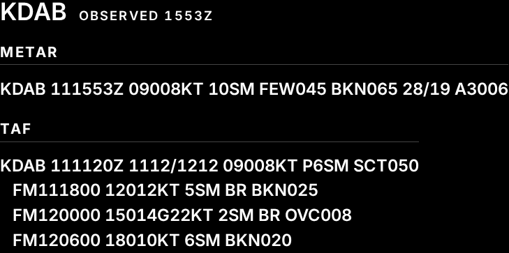

# Aviation weather — UI design spec

How the aviation-weather module composes its content on the display. This is the visual half of the
module's specification — the composition the component (`AviationWeather.svelte`, written in the
module's implementation phase) is built to and reviewed against. It states composition — where each
element sits, at what step, and how the groups are set apart — and cites the
[styling contract](../../../../docs/contracts/display-styling-contract.md)'s tokens each choice
reaches for.

The module's own requirements are authored in a later phase, so the citations to the obligations each
choice realises are firmed up as that phase lands (the
[module contract](../../../../docs/contracts/module-contract.md), *How a module is tracked*; the
requirements belong to #311 aviation-weather requirements & architecture, not this spec). What this
spec cites are the framework universals that already hold for every module, and the styling contract's
tokens.

*Rendered with the bundled Inter face. The region proportion is illustrative — where the module is
placed is the configuration's, not this spec's.*

It is **not** a requirement. Composition is deliberately outside the requirements tree (the
[display design study](../../../../docs/design/display-design-study.md), *What belongs in the
specification*); this spec is where it is written down instead. Where this spec and the styling
contract meet, the contract owns the shared design language (the type and spacing scales, the
emission rule, the grouping vocabulary, the typeface) and this spec owns only how the aviation-weather
module reaches for it.

## The reading — the raw report, unmediated

The module's audience is pilots, who read METAR and TAF fluently and want the **coded report itself**,
not a decoded paraphrase of it. So the module draws the raw observation and the raw forecast
**verbatim** and does not translate them: no flight-category word, no decoded sky or wind glyphs, no
restated plain-language conditions. Every character on the display is Inter's — this module reaches
for **no icon glyph** (the styling contract's *Typeface*: the icon face carries no text and is reached
only through a module's own condition-to-glyph map, and this module declares none).

The content is one station's current conditions, in two reports a pilot tells apart by shape but which
the module labels for scanning:

- a **station line** — the ICAO identifier and the observation time — as the anchor a glance lands on;
- **METAR** — the current observation, verbatim;
- **TAF** — the terminal aerodrome forecast, verbatim, its change groups (`FM…`) each on their own
  indented line as the source writes them.

## Type and spacing

Every element takes a named step from the styling contract's type scale; none is a one-off size.

| Element | Step |
|---|---|
| station identifier | `annotation` |
| observation time | `caption`, uppercase and tracked |
| group labels — *METAR*, *TAF* | `section-header` (uppercase, tracked) |
| the report text, METAR and TAF alike | `body` |

The report sits at `body`, the scale's primary reading step — the reading *is* the report, so it takes
the reading step rather than a hero one. The station line and each report group are separated with
`lg`; a group label and its divider from the report beneath with `md`.

The report is set with `white-space: pre`, so the TAF's own line breaks and the leading indent of its
change groups are kept as the source writes them. All figures are `tabular-nums` (the shared
`.tabular-figures` class), so the digit columns down a report do not drift, and Inter's slashed-zero
feature is on throughout (the styling contract's *Typeface*) — which a coded report full of `0`/`O`
pairs (`SCT050`, `OVC008`) leans on.

## Grouping, and coherence with the rest of the display

Each group label sits above a **dim divider** — the styling contract's grouping vocabulary, earned
here because the region stacks two independently-labelled reports (the contract's decision rule). The
divider is drawn in `--emission-stroke`, below the emission ceiling
(SRS030<!-- Only content is rendered above the emission ceiling -->), and is **enhancement only**: the
label and the spacing carry the METAR/TAF separation on their own, so a bright reflection erasing the
stroke does not collapse the two reports into one run of text. The report text is content, so it is
drawn at full emission, `--emission-content`
(SRS032<!-- Readable text is carried at full emission -->), like every readable glyph on the display.

For coherence across the display, the aviation-weather module shares one design language with the
clock and weather modules: the same dim-stroke **weight** for its dividers as weather's group rules
and the clock's peer rule, the same uppercase-tracked **label idiom** (`.section-label`) for its group
labels and its observation time as weather's group labels and the clock's weekday, the same **type
scale**, and `tabular-nums` throughout.

## Alignment

The reports read left-to-right, so the module reads **left**: the station line, the labels and the
report text are all left-aligned — the same standing exception the display makes for a group heading,
which names what follows and is read left-to-right. The module as a whole still hugs the edge its
region sits against (it takes the region's `--content-anchor`, the styling contract's *Content
anchor*), but its internal text is not right-justified against that edge the way weather's readings
are: a coded report is read as text, not scanned as a column of values.

## States

The module is upstream-backed, so it draws each state its payload can be in, in the viewer's language,
never a blank region (the styling contract; the module contract, *an unavailable module and an
unreachable backend are different states*). These follow the weather module's established treatment
and are not novel:

- **Loading** — a plain line at the `body` step. A module asked for but unanswered is neither a report
  nor a failure.
- **Unavailable** — the failure's own plain-language message at the `body` step, in the module's own
  place, affecting no other module
  (SRS001<!-- A failed module shows why, and only that module -->).
- **Backend unreachable** — the module stands down and renders nothing; the page reports the one
  outage for the whole display (the module contract). This is not the module's own state to draw.

The report always carries its own **observation time** (the METAR's `…Z` group, echoed in the station
line), so how old the reading is stays legible in the report itself rather than needing a separate
stale treatment.

## What each choice realises

The framework universals below already exist and are cited here. The obligations specific to *this
module* — that it shows a station's observation and forecast, verbatim — are the requirements phase's
to author; they are seeded in the next section, and their citations are firmed up as
#311 aviation-weather requirements & architecture lands.

| Composition choice | Realises |
|---|---|
| report text drawn at full emission | SRS032<!-- Readable text is carried at full emission --> |
| dividers and grouping marks below the emission ceiling | SRS030<!-- Only content is rendered above the emission ceiling --> |
| every step at or above the scale's floor | SRS033<!-- Text holds a minimum size against the display, at every resolution --> |
| a failure shown in the module's own place, plainly | SRS001<!-- A failed module shows why, and only that module --> |
| the METAR and TAF drawn verbatim, not decoded | — (module requirement, #311) |
| the station's observation and forecast both shown | — (module requirement, #311) |

## Seeds for the requirements phase (#311)

These are **not requirements** and are not in the tree — they are what the composition above implies,
recorded here to give the requirements phase a starting point. The requirements phase (#311) owns
whether each becomes an obligation, how it is worded, and the source/config/cadence/bound figures this spec deliberately does
not touch:

- The module shows, for a **configured station**, that station's **current observation** and its
  **forecast**.
- Both are shown as the **source's own coded report, unmodified** — the module does not decode,
  translate or re-order the METAR or TAF. (This is the composition's load-bearing choice; if the
  requirements phase (#311) instead required a decoded reading, the composition above would be wrong.)
- The observation carries a **freshness bound** — how far behind the source the shown observation may
  be — as the weather module's does (cf. the intent behind
  SRS046<!-- The weather a viewer sees is no more than fifteen minutes behind its source --> for
  weather; the figure is the requirements phase's (#311)).
- The **change groups of the forecast are preserved** as the source structures them, which is what the
  `white-space: pre` treatment above rests on.
- Whether the module ever shows **more than one station**, and if so how the composition repeats, is
  open — this spec designs the single-station reading only (owner-settled for this phase).

## To confirm

- **Narrow-region wrapping.** A raw METAR is a single long line. Where the shell places the module in
  a narrow region it cannot run off the edge
  (SRS017<!-- Full-screen assembly at kiosk; reflow, no horizontal scroll, at narrower widths -->
  governs reflow), so the report must wrap; how the wrapped continuation is set — a hanging indent, so
  it still reads as one report — is settled with the component in the implementation phase, against the
  region widths the roster actually offers.
