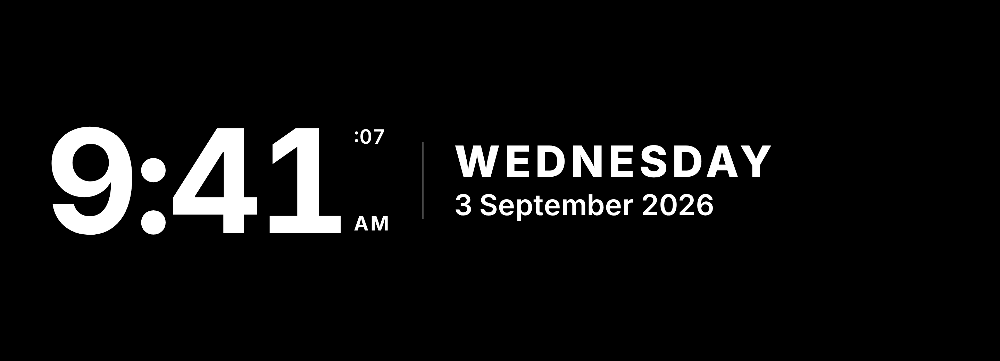

# Clock — UI design spec

How the clock module composes its content on the display. This is the visual half of the module's
specification — the composition the component [`Clock.svelte`](./Clock.svelte) is built to and
reviewed against. It states composition — where each element sits, at what step, and how the two are
related — and cites the obligation each choice realises rather than restating it.

*Rendered with the bundled Inter face. The region proportion is illustrative — where the module is placed is the
configuration's, not this spec's.*

It is **not** a requirement. Composition is deliberately outside the requirements tree (the
[display design study](../../../../docs/design/display-design-study.md), *What belongs in the
specification*); what the tree owns is the behaviour cited below. Where this spec and the
[display styling contract](../../../../docs/contracts/display-styling-contract.md) meet, the contract
owns the shared design language (the type and spacing scales, the emission rule, the grouping
vocabulary) and this spec owns only how the clock module reaches for it.

## The reading — time and date as peers

The module shows the current time and the current date
(SYS009<!-- A viewer can know the current time and date without looking elsewhere -->). The two are
**co-equal** — neither outranks the other, because the need names them together and the mirror ranks
only content against non-content, not one content element against another. They are composed as two
elements facing each other:

- the **time** on the left;
- a dim vertical **rule**;
- the **date** on the right — the weekday, then the day/month/year beneath it.

Equality here is **parity of presence, not of point-size**: the time is four glyphs and the spelled
date is two dozen, so they cannot share a size without one swamping the other. The date instead
carries equal weight through its heavy uppercase weekday and its position, so it reads co-primary
rather than as a caption trailing the time.

**Seconds and the meridiem** ride with the time as a small stack trailing it — the seconds as a
**superscript** (riding high), the meridiem as a **subscript** (sitting low) — so the composition
stays two elements (time, date), never three. Both are config-gated: the seconds appear only when the
configuration selects them
(SRS048<!-- The clock shows or omits seconds per its configuration -->), and the meridiem only in
twelve-hour form (SRS038<!-- The clock's hour form is the one its configuration selects -->).

## Type and spacing

| Element | Step |
|---|---|
| time | `display` — the hero step the scale reserves for the clock face |
| seconds superscript, meridiem subscript | `caption` |
| date weekday | the `section-header` idiom — uppercase, tracked |
| date day/month/year | `body` |

The time and the date are separated by `lg`; within the date, the weekday and the full date by `sm`.
All figures are `tabular-nums`, so the time re-rendering every second never shifts the layout around
it (SRS037<!-- The clock keeps up with real time while the page stays loaded -->).

## Grouping, and coherence with the rest of the display

The vertical rule between the two elements is the styling contract's dim stroke
(`--emission-stroke`, below the emission ceiling) and is **enhancement only**: the whitespace
gap carries the two-element separation on its own, so a bright reflection erasing the stroke does not
collapse the reading into one run of text.

For coherence across the display, the clock and the weather module share one design language: the
same dim-stroke **weight** for the rule as weather's dividers (the clock's vertical rule and weather's
horizontal header rules are the same line), the same uppercase-tracked **label idiom** (the clock's
weekday and weather's group labels), the same **type scale**, and `tabular-nums` throughout.

## States

The clock reads the time off the host running the browser and fetches nothing
(SRS036<!-- The clock reads the time off the host running the browser -->). It therefore has **no
loading, unavailable, stale or failed state** — one designed look, and that is all. It declares no
`reachable` prop: a backend outage takes nothing from it (the
[module contract](../../../../docs/contracts/module-contract.md), *an unavailable module and an
unreachable backend are different states*).

## What each choice realises

| Composition choice | Realises |
|---|---|
| time and date both present, co-equal | SYS009<!-- A viewer can know the current time and date without looking elsewhere --> |
| time on the display step; date co-primary at full white | SRS032<!-- Readable text is carried at full emission --> / SRS033<!-- Text holds a minimum size against the display, at every resolution --> |
| meridiem shown only in twelve-hour form | SRS038<!-- The clock's hour form is the one its configuration selects --> |
| date shown per configuration | SRS039<!-- The clock shows the date when its configuration asks for it --> |
| seconds shown per configuration | SRS048<!-- The clock shows or omits seconds per its configuration --> |
| one look, no failure states | SRS036<!-- The clock reads the time off the host running the browser --> |

## Orientation

This composition is **horizontal only** — time left, date right. It is not built for a narrow,
vertical region; the styling contract's *form follows the display target* is served by the one
orientation the display's regions call for.
