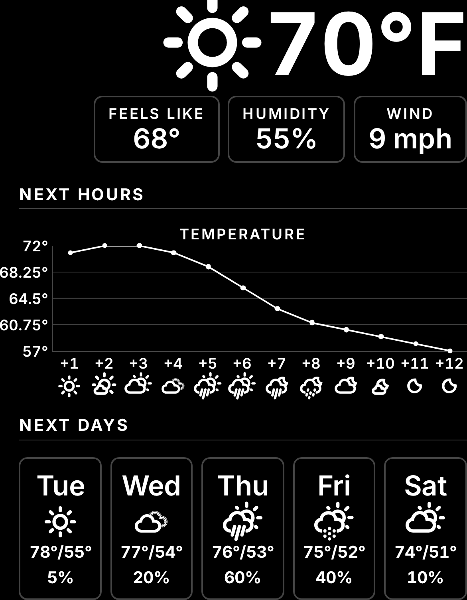

# Weather — UI design spec

How the weather module composes its content on the display. This is the visual half of the module's
specification — the composition the component [`Weather.svelte`](./Weather.svelte) is built to and
reviewed against. It states composition — where each element sits, at what step, and how the groups
are set apart — and cites the obligation each choice realises rather than restating it.

*Rendered with the bundled Inter and Weather Icons faces. The region proportion is illustrative — where the module is
placed is the configuration's, not this spec's.*

It is **not** a requirement. Composition is deliberately outside the requirements tree (the
[display design study](../../../../docs/design/display-design-study.md), *What belongs in the
specification*); what the tree owns is the behaviour cited below. Where this spec and the
[display styling contract](../../../../docs/contracts/display-styling-contract.md) meet, the contract
owns the shared design language (the type and spacing scales, the emission rule, the grouping
vocabulary) and this spec owns only how the weather module reaches for it.

## The reading, in three groups

The module shows the present weather, the next twelve hours, and the next five days, the three set
visibly apart
(SRS045<!-- The weather module shows the present weather and the outlook apart from each other -->).
Each group is drawn with a **different treatment**, which is what carries that separation — a block, a
curve, a strip of cards — so the distinction survives even where a grouping stroke would not.

### Present — one composed unit

A single reading, composed as one unit rather than a stack of parts:

- the condition **glyph** and the **temperature** on a shared baseline, side by side — one reading,
  not two stacked figures; the glyph alone carries the sky, so no condition word repeats it in text
  (SRS050<!-- The weather module draws day and night apart -->);
- beneath that, three **cards** — feels-like, humidity, wind — each a small tracked label over its
  value, read as one glanceable row rather than one dotted caption line. A card is the display's
  bordered, rounded treatment for one self-contained reading; the daily strip below reuses it.

Its parts are the present set of
SRS044<!-- The weather module puts the present conditions and the near-term outlook across the boundary -->.
Day or night is carried by *which glyph is drawn*
(SRS050<!-- The weather module draws day and night apart -->; the styling contract's *Typeface*), never
by dimming or colour.

### Next hours — a toggling curve over an axis

The hours are drawn as the one place a shape reads faster than a column of figures:

- a **full-white curve** across the next twelve hours, toggling on a configured interval between two
  series — temperature, then precipitation chance — never both at once and never colour-coded apart,
  so the reading stays one shape rather than two overlaid ones;
- a **y-axis** to its left, always five labels over four equal bands regardless of the active series
  or its own range, so the scale reads the same shape every render;
- beneath the curve, an **x-axis** of relative hour labels (`+1`…`+12`, not clock time) and, below
  that, each hour's condition glyph (day or night,
  SRS050<!-- The weather module draws day and night apart -->) — the curve's vertices, the x-axis
  labels and the glyphs all share one column per hour, so the three read in a single vertical line.

The curve gives the trend; the axis restores the figure a bare line would drop, without a label
competing with the curve's own shape at every vertex. The curve is content, so it is drawn at full
emission like the glyphs and figures around it.

### Next days — a strip of cards

The days are a strip of five **cards** — the same bordered, rounded treatment as the present
conditions' stats — each carrying: the day, its condition glyph, its high/low, its precipitation
chance. Cards, not a curve — so days read distinct from the hours' curve-and-axis at a glance, the
third of the three treatments.

## Type and spacing

Every element takes a named step from the
[styling contract](../../../../docs/contracts/display-styling-contract.md)'s type scale; none is a
one-off size.

| Element | Step |
|---|---|
| present temperature, present glyph | `headline` |
| present stat label (feels-like/humidity/wind) | `caption` |
| present stat value | `annotation` |
| group labels — *Next hours*, *Next days* | `section-header` (uppercase, tracked) |
| series title (*Temperature*/*Precipitation*), y-axis tick labels, x-axis hour labels | `caption` |
| day card weekday, day card glyph | `annotation` |
| day card high/low and precipitation readings | `section-header` |

Groups are separated with `lg`; a header and its divider from what follows with `md`; rows and cells
within a group with `sm`; an icon from its value with `xs`. All figures are `tabular-nums`, so a
value changing under the display never shifts the layout and columns line up down a strip.

## Grouping, and coherence with the rest of the display

Each group label sits above a **dim divider** — the styling contract's grouping vocabulary, earned
here because the region stacks three independently-labelled groups (the contract's decision rule).
The divider is drawn in `--emission-stroke`, below the emission ceiling, and is
**enhancement only**: the spacing between groups carries the separation on its own, so a bright
reflection erasing the stroke does not collapse the reading.

For coherence across the display, the weather module and the clock share one design language: the
same dim-stroke **weight** for every divider (weather's horizontal header rules and the clock's
vertical peer rule are the same line), the same uppercase-tracked **label idiom** (this module's
group labels and the clock's weekday), the same **type scale**, and `tabular-nums` throughout.

## States

The module is upstream-backed, so it draws each state its payload can be in, in the viewer's
language, never a blank region (the styling contract; the
[module contract](../../../../docs/contracts/module-contract.md)):

- **Loading** — a plain line (*Reading the weather…*) at the `body` step. A module asked for but
  unanswered is neither a reading nor a failure.
- **Unavailable** — the failure's own plain-language message at the `body` step, in the module's own
  place, affecting no other module
  (SRS001<!-- A failed module shows why, and only that module -->).
- **Backend unreachable** — the module stands down and renders nothing; the page reports the one
  outage for the whole display (the module contract, *an unavailable module and an unreachable
  backend are different states*). This is not the module's own state to draw.

## What each choice realises

| Composition choice | Realises |
|---|---|
| present / hours / days each a different treatment | SRS045<!-- The weather module shows the present weather and the outlook apart from each other --> |
| the glyph on the present reading and on each hour | SRS050<!-- The weather module draws day and night apart --> |
| present block draws the full present set, not half of it | SRS044<!-- The weather module puts the present conditions and the near-term outlook across the boundary --> |
| full-white curve, glyphs and figures | SRS032<!-- Readable text is carried at full emission --> / SRS030<!-- Only content is rendered above the emission ceiling --> |
| every step at or above the scale's floor | SRS033<!-- Text holds a minimum size against the display, at every resolution --> |

## To confirm in situ

The curve is full-white content but a **thin stroke**, and the design study is explicit that thin
strokes are the first thing a bright reflection dissolves. The curve's stroke weight — in both series
it draws, temperature and precipitation alike — is the one part of this composition to check against
a photograph of the deployed display before it is considered final, not against a monitor.
